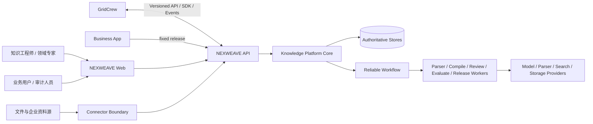
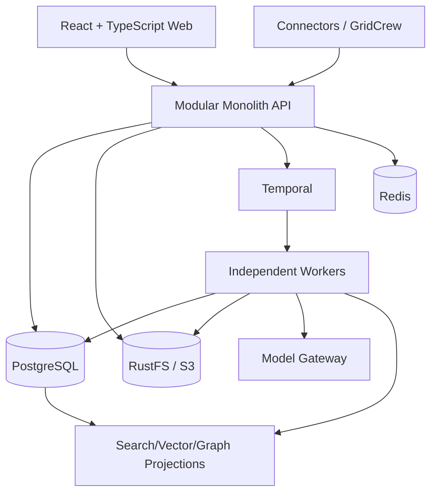

# NEXWEAVE Architecture Baseline

> 状态：M0 终局架构仍冻结；M1—M8 已正式验收。用户于 2026-09-01 正式下发 M9；ADR-0029/0030 冻结 Equipment RCA Pack、公开资料和 GridCrew 延期边界。9 份资料准入、真实 Pack 安装及 4 份 Source→Compile 技术试点已完成；专家、阈值和真实评审/Release 证据仍为 P0，未验收前不得进入 M10。

## 1. 不可变原则

### 产品边界

1. NEXWEAVE 是独立企业可信知识平台，不是 GridCrew 子模块。
2. GridCrew 通过正式 Knowledge API、事件或 SDK 消费已发布知识。
3. NEXWEAVE 不负责群聊、数字员工排班、任务协作或通用 Agent 执行。
4. GridCrew 只能提交资料、反馈、案例草稿、冲突线索或审核任务，不能直接写正式知识。
5. 业务应用默认只能消费固定 Release，不能默认读取草稿。
6. Obsidian 是可选专家客户端，不是权威状态源。

### 知识可信

- Raw First：原始字节、版本、checksum、来源和密级不可被模型覆盖。
- Schema Before Generation：知识编译必须锁定有效 SchemaVersion。
- Evidence Native：正式 Claim 与因果 Relation 必须绑定可定位 Evidence。
- Human in the Loop：高风险知识、冲突与 Release 必须人工审核批准。
- Draft/Release Separation：草稿、审核中对象和正式 Release 隔离。
- Conflict Instead of Overwrite：冲突形成一等对象，不静默覆盖。
- Version Reproducibility：回答、评测、审核和发布可还原 Source、Schema、Prompt、Model、索引和 Release。
- AI 生成只是候选，只有审核并发布后才是正式知识资产。

### 平台与领域解耦

- 平台核心不得写死 RCA、设备、行业或客户字段。
- Domain Pack 仅通过安全声明、模板、术语、Prompt、规则、评测和样例扩展。
- Pack 不得修改平台核心数据库结构、依赖内部实现或执行任意代码。
- Pack 具有独立 ID、版本、依赖、兼容范围、签名和安装记录。
- R1 的语义模型是 SchemaVersion 的逻辑视图和完整快照，不新增独立 OntologyVersion、第二套发布权威或 `/ontologies` 资源。
- 跨 Pack 类型复用、层级、术语和映射必须显式声明并确定性组合；同名、翻译、向量相似或 LLM 判断不得触发静默合并。

### 集成与执行

- 模型调用经 Model Gateway；外部资料/系统经 Connector。
- 解析、编译、审核、评估、发布、安装和回流使用可靠 Workflow。
- Workflow 保持确定性；I/O 位于幂等 Activity/Task。
- API、事件、ID、状态、版本、错误和 SourceAnchor 必须契约先行。
- 权限、审计、Evidence、Release 和幂等不能被集成层绕过。

## 2. 系统上下文



## 3. 冻结容器架构



R1 冻结为 Python 3.12/FastAPI 模块化单体 API + 独立 Temporal Worker + React/TypeScript Web。Java/CUD4.0 仅允许作为后续企业适配壳，不形成第二产品核心。

## 4. 核心模块边界

| 模块 | 责任 | 禁止承担 |
|---|---|---|
| Identity & Access | OIDC、服务身份、RBAC/ABAC、租户/空间隔离 | 前端代替授权 |
| Workspace | KnowledgeSpace、成员、策略 | 领域专用对象 |
| Source & Parsing | Raw、SourceVersion、ParseJob、Segment、SourceAnchor | 修改原始内容 |
| Schema & Semantic Model | SchemaDefinition/Version、稳定类型 key、属性、层级、关系、术语、映射、模板、Pack 组合与兼容检查 | 独立 OntologyVersion 双权威、运行任意 Pack 代码或把语义合规当事实证据 |
| Compile | 候选提取、消歧、页面决策、轨迹 | 直接发布正式知识 |
| Wiki | 页面草稿、版本、diff、人工保护区 | 覆盖历史版本 |
| Claim & Evidence | 主张、正反证据、锚点有效性 | 以模型置信度替代证据 |
| Conflict & Review | 冲突、任务、动作、批准、职责分离 | 静默覆盖和自批高风险内容 |
| Quality | Lint、评测集、运行、门禁 | 将检索相似度当事实置信度 |
| Release | 候选、审批、不可变清单、指针切换、回滚 | 修改已发布对象 |
| Query | 固定 Release 的检索、回答、Citation、不确定性 | 默认混用 Release 或读草稿 |
| Integration | Connector、SDK、Webhook、Obsidian、GridCrew | 绕过 Source/权限/审计 |
| Audit & Observability | AuditLog、Outbox、Trace/Metric/Log | 保存密钥或未脱敏敏感内容 |

## 5. 权威状态

| 信息 | 权威源 | 非权威表示/投影 |
|---|---|---|
| 原始文件字节 | 对象存储 + SourceVersion checksum | 解析文本、预览、缓存 |
| 业务对象、审核、批准、发布结果 | 关系数据库 | Markdown/YAML、搜索/向量/图投影 |
| 长流程执行事实 | Temporal Workflow | 数据库任务查询投影 |
| 正式知识版本 | 不可变 Release manifest 与 ReleaseItem | 当前服务指针、导出包、索引 |
| 有效语义模型 | 不可变 SchemaVersion + composition checksum + 精确 PackVersion/checksum 输入 | UI 类型树、导出 RDF/JSON、搜索/图投影、Prompt |
| 搜索/向量/图 | 可由固定 Release 重建的投影 | 不得成为事实源 |
| 问答记录 | QuerySession/QueryAnswer/Citation + 固定 Release | UI 会话状态 |

数据库不作为第二套 Workflow 推进引擎；Temporal 也不替代业务对象和发布结果的持久化权威。两者由稳定业务 ID、Workflow ID 和对账机制连接。

## 6. Draft 与 Release 隔离

```text
Raw (immutable SourceVersion)
  → Draft candidates (AI/Manual, mutable by new version)
  → Review/Conflict/Evaluation
  → ReleaseCandidate
  → immutable Release + rebuildable projections
```

- Draft 查询必须是显式、授权的调试行为。
- Release 只引用固定对象版本、SchemaVersion、PromptVersion、ModelProfile 和索引配置。
- Release 中的 SchemaVersion 固化规范化语义快照、composition checksum 和精确 PackVersion/checksum；Pack 升级、禁用或回滚不得改变历史 Release。
- 回滚只切换服务指针，不篡改历史 Release。

## 7. Port / Gateway 边界

M0 冻结：Persistence、ObjectStorage、Workflow、Cache、Parser、OCR、ModelGateway、Embedding、Search、Vector、GraphQuery、Identity、Audit、Connector、Notification。M1 已实现 `IdentityProviderPort`、`ObjectStoragePort` 和 `MalwareScannerPort`；M2 已实现厂商无关 `WorkflowGatewayPort` 及 Temporal adapter；M3 已实现 `ParserPort/OcrPort` 边界、v2 Workflow 与隔离 Parser adapter 并完成本地验证。语义模型组合是 M4 的纯领域/应用能力，不引入本体厂商 SDK 或 Ontology Provider。领域、契约和应用端口包不得依赖厂商 Adapter。

## 8. GridCrew 集成位置

GridCrew 集成位于 API/SDK/Integration 层。NEXWEAVE 暴露固定 Release 的 query、evidence、graph 和 release metadata 能力；GridCrew Skill 绑定 `tenant_id/space_id/release_id/policy_version`。事件经 Outbox 与签名 Webhook/Event 发布。两边独立部署、独立数据库、独立审计，并以 correlation ID 关联。

## 9. 依赖规则

```text
apps/adapters → application → domain
workers/adapters → workflow/contracts → domain
integration adapters → public contracts
domain packs → domain-pack public spec only

domain ✕ FastAPI/SQLAlchemy/Temporal/vendor SDK
contracts ✕ application internals/vendor SDK
domain-pack ✕ platform internals/arbitrary executable code
```

## 10. M0 冻结技术栈

- Monorepo；React + TypeScript；pnpm Workspace；
- Python 3.12 + FastAPI/Pydantic/SQLAlchemy/Alembic；
- Temporal Python SDK；PostgreSQL + pgvector；RustFS/S3；Redis；
- PostgreSQL 全文检索 + pgvector + Relation 表作为 R1 默认投影；需要专用搜索/图引擎时必须由证据和 ADR 触发；
- OIDC 协议兼容，身份服务可独立部署；OpenTelemetry；Docker Compose 本地基线；保持 Kubernetes 可迁移性；
- Markdown/Git 只作交换、展示和导出；关系数据库和不可变 Release manifest 是正式业务权威；
- R1 Query 绑定一个空间内的单一固定 Release；不混用多个 Release；
- Release 使用空间内 SemVer、不可变 manifest 和可切换 channel pointer，回滚只移动指针；
- 数据密级为 PUBLIC、INTERNAL、CONFIDENTIAL、HIGHLY_RESTRICTED；最高密级不得出域调用外部模型。

本机 Docker Desktop 作为 M0 可复现联调环境；Compose 同时启动 PostgreSQL、RustFS、Redis、Temporal、API、Worker 和 Web。RustFS 只位于对象存储 Adapter 边界，业务代码仅依赖 `ObjectStoragePort` 与批准的 S3 子集。生产部署拓扑不在 M0 内冻结，版本成熟性和生产推广受 ADR-0017/SPK-004 门禁约束。

## 11. M0 仍保留的后续决策

完整列表见 `OPEN_QUESTIONS.md`。解析失败语义已由 ADR-0021 在 M3 校准中冻结；Pack UI 扩展、GridCrew 最终租户映射、Obsidian 冲突回写、审核策略、连接器白名单、RCA 试点资料和量化门槛仍在对应业务 Milestone 前决策；既有阶段不伪造专家阈值或外部系统回执。

## 12. M1 已实现增量

- 认证：生产兼容 OIDC issuer/JWKS/audience/expiry 校验；独立 local development 签发器；token 自报角色不授予权限；
- 授权：默认拒绝 RBAC+ABAC，联合 tenant、space membership、对象状态、密级和 service audience；拒绝写入 AuditLog；
- Workspace：KnowledgeSpace `ACTIVE/ARCHIVED`、强 ETag、幂等、成员授权/撤销；
- 治理：ModelProfile、追加式 PromptVersion、ConnectorDefinition 仅保存配置和 Secret 引用，不执行模型或外部同步；
- 对象：受控上传会话、RustFS 条件写、checksum/size/type/classification、扫描门禁和下载重新授权；ManagedObject 不冒充 SourceVersion；
- 事务与契约：PostgreSQL 业务写入与 Audit/Outbox/Idempotency 同事务，OpenAPI/事件/SDK 版本化，W3C trace 贯穿 Web/API/DB/S3；
- 隔离：应用授权 + 强制范围查询 + 复合外键为 M1 权威；RLS 因缺少连接池/后台任务/运维实证暂不启用，详见 ADR-0019；
- Workflow：M1 无长任务，继续只运行确定性的 Temporal health Workflow，不虚构业务 Workflow。

## 13. M2 已实现增量

- 执行权威：Temporal Namespace `nexweave-dev`，Workflow Queue `nexweave-m2-workflows` 与 Activity Queue `nexweave-m2-activities` 分离；数据库不推进执行状态；
- 七类内核：SourceIngestion、KnowledgeCompile、HumanReview、QualityEvaluation、KnowledgeRelease、DomainPackInstall、GridCrewFeedbackIngestion 均以版本化 Workflow 类型注册，但 Activity 只写 M2 Stub/投影事实；
- 可靠性：稳定 Workflow ID、Run ID 映射，Update/Signal、幂等命令、暂停/继续/取消、人工等待、超时升级、指数重试、心跳与逆序补偿；
- 投影：PostgreSQL 保存 WorkflowTask/Step/Event 查询投影、审计与 Outbox；事件追加式，投影带 revision/同步标记，可从 Temporal 查询状态对账修复；
- 边界：Workflow 模块不调用网络、数据库、文件或模型；I/O 全部在可重试 Activity/API adapter；
- Web/API：服务端授权的任务创建、查询、控制和对账 API，真实任务中心与 typed SDK。页面状态与数据库投影均不成为第二套执行引擎；
- 验证：真实 Temporal 覆盖七类运行、重试、重复 Update、人工批准、暂停恢复、取消补偿、Worker 重启、投影修复和历史 replay；官方时间跳跃测试已在本地和 GitHub Actions run `32808198635` 独立门禁通过。

## 14. M3 已实现并正式验收边界

- 用户已正式下发并于 2026-08-29 验收 M3；Source/Parse 业务代码、迁移、本地回归、真实 ClamAV-backed Compose E2E 与远程供应链门禁已完成；
- M2 `nexweave.source-ingestion.v1` 保持 Kernel Stub/Replay 语义，不能转写为扫描/解析成功；
- ADR-0021 冻结每次 reparse 新建 ParseJob、retry 同配置、partial/failure、active/latest 指针、SourceVersion 替代、Anchor 重定位与扫描 PDF `OCR_REQUIRED`；
- M3 业务 Workflow 使用 `nexweave.source-ingestion.v2`，Parser/OCR I/O 只允许位于幂等 Activity/adapter；
- 当前无真实 OCR Provider；扫描 PDF 只诚实声明 `OCR_REQUIRED/PARTIAL`。归档 M2 history Replay、真实 OCR 和生产 HA/DR 仍未声称完成。

## 15. M4 语义模型已实现边界

- ADR-0022 冻结 Semantic Model 以 SchemaVersion 为唯一有效版本权威，不新增 OntologyVersion；
- SchemaVersion 固化 EntityType/PropertyDefinition/TypeHierarchyEdge/RelationType/TypeTerm/ConceptMapping、组合输入和 checksum；
- Domain Pack 依赖 DAG 按确定性顺序组合；不兼容重复 key、循环、映射歧义和破坏性变化阻断发布，禁止后安装覆盖先安装；
- Pack 安装只生成 DRAFT SchemaVersion，Schema 发布需独立授权；历史 Schema/Pack/Release 不因升级、禁用或回滚而修改；
- M4 已正式下发并实现 SchemaVersion 单一权威、语义定义、签名 Pack 组合、安装生命周期、API/SDK/UI 和 additive `0005_m4`；本地技术验收已通过。
- M4 已正式验收；其 Schema/Pack 继续作为 M5 固定编译输入，不得以候选知识冒充 Release。

## 16. M5 受治理编译与 Wiki 已实现边界

- ADR-0024 冻结 CompileJob 的 PUBLISHED SchemaVersion/composition、SourceVersion/checksum、PromptVersion、ModelProfile 与归一化版本；运行中不可替换。
- `nexweave.knowledge-compile.v1` 保持历史 Stub，真实业务使用 v2；模型/数据库 I/O 仅位于可重试 Activity。
- `ModelGatewayPort` 隔离供应商；当前仅启用可回放、无网络的 `nexweave.local-structured/1` 验收 Provider，未配置外部 LLM adapter，不能宣称真实外部 LLM 能力。
- Entity/Page 稳定身份、候选 Claim/Relation/Evidence/Conflict/Lint、Wiki 自动生成区/人工保护区和追加式版本由 additive `0006_m5` 实现。
- M5 输出始终为候选/DRAFT；后续正式化只能经过已验收的 M6 Review/Evidence gate，再进入 M7 Release，不能回写或把候选直接当作正式知识。

## 17. M6 正式知识与审核已实现边界

- ADR-0025 与 additive `0007_m6` 实现正式 Claim/Evidence、ConflictCase 和分阶段 HumanReview v2；Evidence gate、职责分离和历史事实不可变由服务与数据库共同执行。
- M6 已正式验收，其输出是 M7 ReleaseCandidate 的唯一正式知识输入，不允许候选知识绕过审核。

## 18. M7 质量、发布、图谱与问答已实现边界

- ADR-0026 与 additive `0008_m7` 实现 EvaluationSuite/Run、ReleaseCandidate/Item、独立审批、不可变 Release/Item、Pointer/History、Relation、QuerySession/Answer/Citation 和可重建检索投影。
- `nexweave.quality-evaluation.v2` 与 `nexweave.knowledge-release.v2` 固定输入并将 I/O 留在幂等 Activity；v1 历史定义不改写。
- Query 必须指定单一正式 Release；权限、密级、accepted Evidence 与 VALID Anchor 在服务端过滤，证据不足返回拒答。向量相似度仅用于召回，不等同事实置信度。
- 回滚只以强 ETag 推进 ReleasePointer，不修改历史 Release；JSON/Markdown 导出与检索投影可由 ReleaseItem 重建。
- M7 已完成隔离真实 E2E、本地技术验收并由用户正式验收。

## 19. M8 Connector、Obsidian 与 Wiki 图谱已实现边界

- ADR-0027 与 additive `0009_m8_connector_obsidian` 实现受控只读 Connector、CredentialRef、显式 allowlist、Watermark 和 Raw→SourceVersion 路径；Obsidian 回导只生成草稿或 Conflict。
- ADR-0028 实现有界、受权限控制的 Wiki 双向链接导航投影，并与 M7 固定 Release Relation Graph 分离。
- M8 已正式验收；GridCrew 对端集成按用户指令延期，不能视为已实现。

## 20. M9 Equipment RCA Pack 执行边界

- ADR-0029 规定 RCA 概念、术语、KKS/设备编码、模板、Prompt、Lint、问题集和 UI 元数据只能进入声明式 Pack，不得进入平台核心。
- M9 技术 Pack 复用既有 M4 Pack、M7 Evaluation/Release/Query 契约，不新增第二套对象、状态、数据库或发布权威。
- 未提供真实脱敏资料、专家和 GridCrew 对端时，只允许明确标记的合成技术 fixture；不得形成真实试点、专家确认或联合 Demo 结论。

## 阶段 A 增量运行基线（2026-09-09）

依据 11C 与 ADR-0033，新增 ForecastRun 同事务投递记录、Temporal v2 活动心跳与对账、当前授权下的取消及冻结输入重跑、可选 worker 租约与统一启动。请求 ASGI 外层隔离上一个请求的 OpenTelemetry context。`0011_m95a` 不修改 R1 Evidence、Release、SourceAnchor、Schema/Pack 原始签名或历史迁移。v1 Workflow 保留历史兼容；整机恢复与生产服务化限制见阶段 A 手册。停止在 R1/M9.5 稳定基础，不进入阶段 B 或 M10。

## 阶段 B 增量自主运行基线（2026-09-09）

用户已明确下发 B，覆盖上一阶段的停止边界。依据 11D / ADR-0034，受控 CSV 预览和绑定预检复用 Connector、Schema 权威及源权限；保存再次校验并保持不可变 Binding。同窗口场景比较限定相同历史、语义、模型 revision 与时间轴，不表达因果关系。新增最小对象选择投影，修复源失效/归档读取门禁及 Source 公开响应投影，不改变 Evidence、Release、Workflow、模型版本或旧迁移。B 已完成本地技术验证，停止在 B，不进入 C/M10。

## 阶段 C 增量知识回接基线（2026-09-09）

用户已明确下发 C，覆盖上一阶段停止边界。11E / ADR-0035 引入独立读时 Forecast knowledge-context：复用既有 Release Query/Gateway，选定同空间固定 Release 后，仅从冻结 Claim/Evidence 恢复当前仍可见有效的依据，展示原文定位与版本哈希；不返回未经支持的检索摘要。组合结果不写回 Forecast/Evidence/Release，不构成因果推断或设备适用性判断。无新迁移/依赖，旧图谱隔离疑点单独保留。C 已完成本地技术验证，停止在 C，不进入 M10。

## 阶段 D 固定发布读取收口（2026-09-10）

依据 11F / ADR-0036，Query 新建及历史读取按当前授权/证据有效性输出冻结 Claim；多来源主张遵循当前最高密级。历史读取只生成响应投影，不改旧记录。Graph 从发布快照读取并执行成员、同发布证据与来源门禁，预算溢出拒绝或明确截断。R1 Evidence/Release/Workflow 与 Forecast 存储语义保持。无新迁移/依赖；关键浏览器路径完成本地技术验证，停止 D，不进入 M10。
