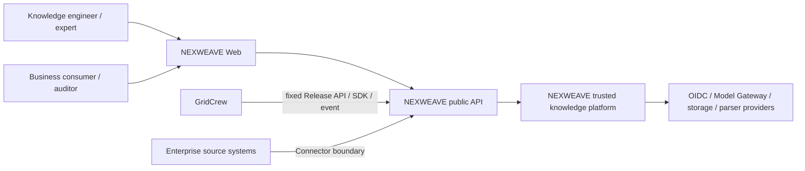
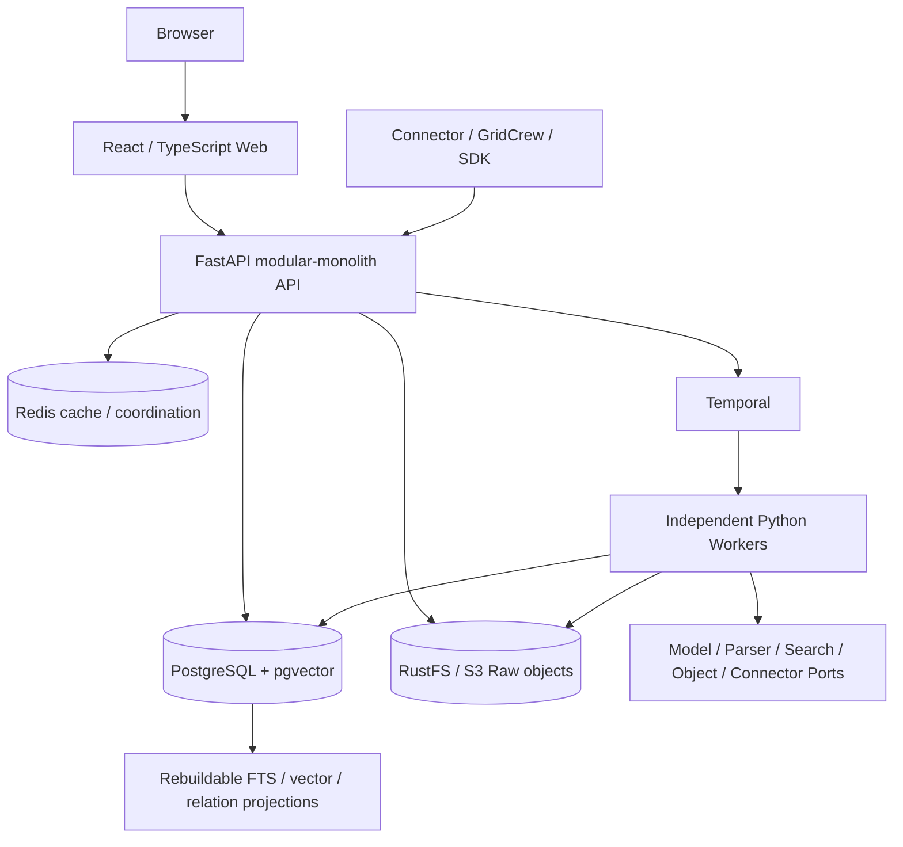
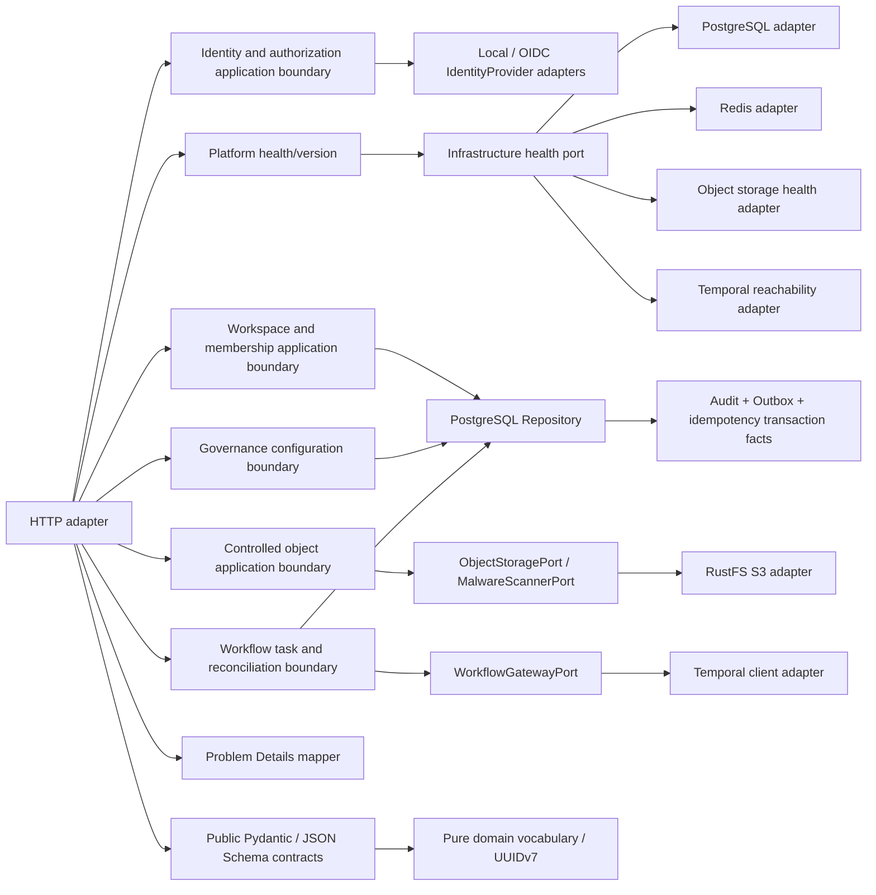
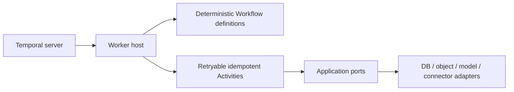

# M2 C4 Architecture Baseline

> Status: M0 context/container boundaries remain Accepted; ADR-0019 adds M1 platform components and ADR-0020 adds the M2 reliable Workflow kernel, task projection and task center without changing the frozen container topology.

## Level 1 — System context

NEXWEAVE owns knowledge ingestion, compilation, evidence, review, evaluation, immutable release and trusted query. It does not own GridCrew task orchestration or directly share GridCrew business state.

## Level 2 — Containers

M2 runs eight services through Compose: the M0 health Worker remains isolated and `worker-kernel` registers seven versioned Workflow definitions on a dedicated Workflow queue plus Activities on a dedicated Activity queue. The API exposes authenticated task control and PostgreSQL projection queries; future Model/Parser/Search/Connector ports remain boundaries, not claims of implemented adapters.

## Level 3 — API components

Business modules follow `HTTP/Worker adapter → application Port/use-case boundary → domain`. ORM, FastAPI, Temporal and provider SDKs cannot enter `packages/domain`, `packages/contracts` or `packages/application`; an automated architecture test enforces the rule.

## Level 3 — Worker components

M0 retains `PlatformHealthWorkflow`. M2 adds seven explicit deterministic kernel Workflows. They use Temporal Update/Signal/query and call only named Activities; projection, step and compensation I/O is isolated in Activities. M2 Activity outcomes are Stubs and do not create M3+ business aggregates.

## Source tree mapping

| Boundary | Location | M2 content |
|---|---|---|
| Web adapter | `apps/web` | authenticated shell, platform pages and real M2 task center |
| API adapters | `apps/api` | M1 platform adapters plus Temporal gateway, task repository/routes and reconcile |
| Application boundary | `packages/application` | M1 ports plus vendor-neutral `WorkflowGatewayPort` |
| Pure domain | `packages/domain` | platform vocabulary plus Workflow types/states/commands/stable IDs |
| Public contracts | `packages/contracts` | M1/M2 Pydantic, JSON Schema, event payload and OpenAPI snapshots |
| Client SDK | `packages/sdk` | typed Python/TypeScript platform and task API clients |
| Workflow hosts | `workers/health`, `workers/kernel` | deterministic health plus seven M2 kernel Workflows/Activities |
| Persistence evolution | `migrations` | M0/M1 foundations plus `0003_m2_temporal_kernel` |
| Local deployment | `compose.yaml`, Dockerfiles | PostgreSQL/Redis/RustFS/Temporal/API/two Workers/Web |

## Evolution constraints

- Split a module into a service only after stable Port/contract evidence exists; database table ownership and outbox behavior must remain explicit.
- Search/vector/graph stores are projections, not business authority.
- Provider reuse with GridCrew never grants shared business database or implicit availability authority.
- Production Kubernetes, HA, DR and domestic-platform certification are later-stage deployment decisions, not M0 claims.
