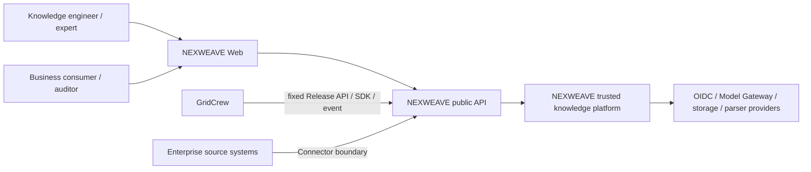
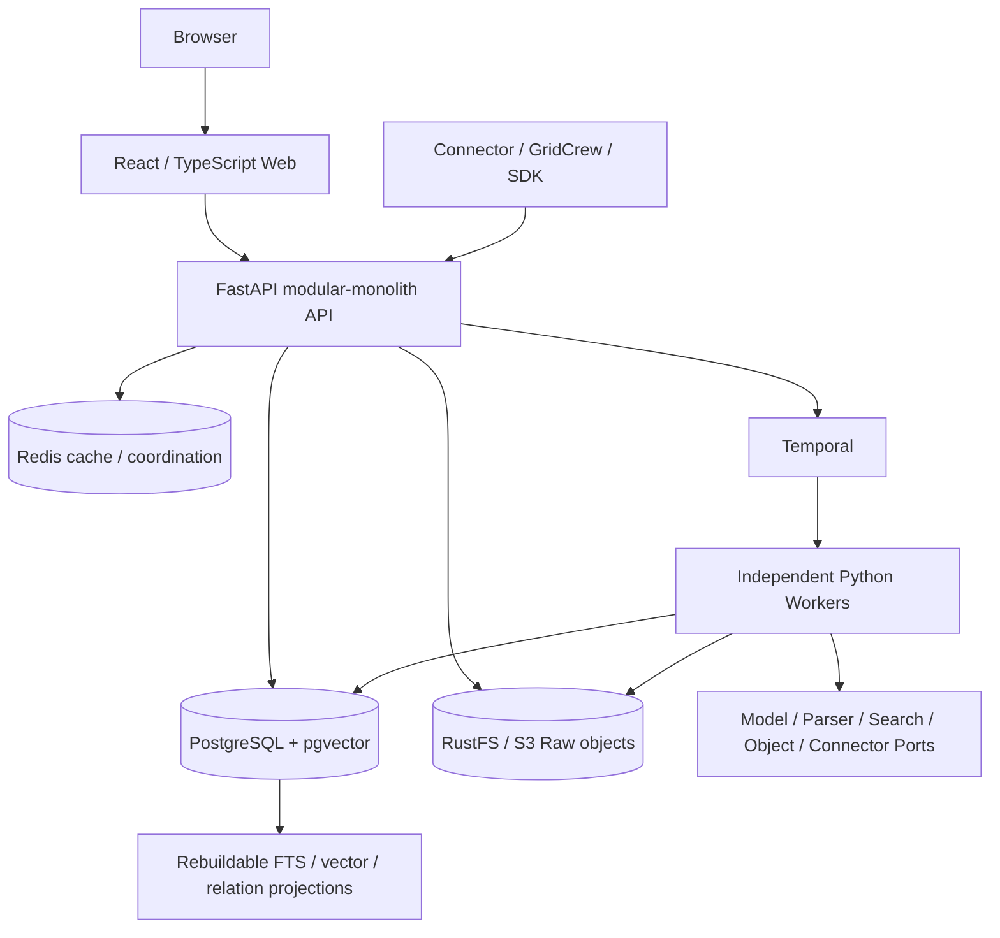
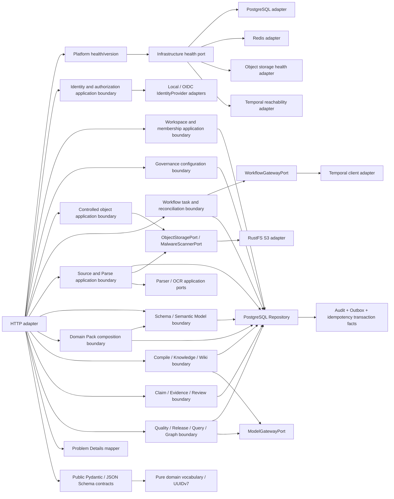
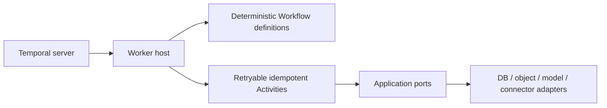

# M7 C4 Architecture Baseline

> Status: M0 context/container boundaries remain Accepted; M1—M7 are formally accepted. ADR-0026 M7 Quality/Release/Graph/Query passed local technical acceptance without adding a second service authority.

## Level 1 — System context

NEXWEAVE owns knowledge ingestion, compilation, evidence, review, evaluation, immutable release and trusted query. It does not own GridCrew task orchestration or directly share GridCrew business state.

## Level 2 — Containers

M2 runs the health and kernel Workers through Compose. M3 adds Source/Parse, M4 Schema/Pack, M5 Compile/Wiki and Model Gateway, M6 Review/Evidence, and M7 Quality/Release/Graph/Query within the existing API/Worker topology. M7 uses PostgreSQL Relation/FTS/pgvector projections and does not introduce a graph/search database authority or provider SDK dependency in domain/contracts.

## Level 3 — API components

Business modules follow `HTTP/Worker adapter → application Port/use-case boundary → domain`. ORM, FastAPI, Temporal and provider SDKs cannot enter `packages/domain`, `packages/contracts` or `packages/application`; an automated architecture test enforces the rule. M5 Model Gateway is an application Port implemented by an adapter, while Compile/Wiki invariants remain pure domain logic; the local structured adapter is deterministic/no-network and is not represented as an external LLM.

## Level 3 — Worker components

M0 retains `PlatformHealthWorkflow`. M2 adds seven explicit deterministic kernel Workflows. They use Temporal Update/Signal/query and call only named Activities; projection, step and compensation I/O is isolated in Activities. M2 Activity outcomes are Stubs and do not create M3+ business aggregates.

M3 adds `nexweave.source-ingestion.v2`, M4 `domain-pack-install.v2`, M5 `knowledge-compile.v2`, M6 `human-review.v2`, and M7 `quality-evaluation.v2`/`knowledge-release.v2` while preserving v1 history definitions. Workflow code coordinates fixed references only; database, model, object and projection I/O remains in idempotent Activities.

## Source tree mapping

| Boundary | Location | Current through M7 |
|---|---|---|
| Web adapter | `apps/web` | API-driven platform, Source, Schema/Pack, Compile/Wiki, Review, Quality, Release, Graph and Ask pages |
| API adapters | `apps/api` | platform through M7 routes/repositories plus provider adapters |
| Application boundary | `packages/application` | provider-neutral Workflow/Object/Parser/OCR/Model/Search/Vector/Graph ports |
| Pure domain | `packages/domain` | platform through M7 deterministic rules and invariants |
| Public contracts | `packages/contracts` | M1—M7 Pydantic, JSON Schema, event payload and OpenAPI snapshots |
| Client SDK | `packages/sdk` | typed Python/TypeScript clients through M7 |
| Workflow hosts | `workers/health`, `workers/kernel`, parser sandbox | deterministic Workflows through M7, trusted Activities and isolated parsing |
| Persistence evolution | `migrations` | M0—M7 through additive `0008_m7` |
| Local deployment | `compose.yaml`, Dockerfiles | accepted topology with final M7 API/Worker/Web code |

M4 implemented mapping: Schema/Semantic Model and Pack routes/repositories remain in `apps/api`; pure semantic objects/composition stay in `packages/domain`; public representations stay in `packages/contracts`; deterministic install orchestration stays in the Worker boundary; persistence is additive `0005_m4`. No independent Ontology service, table authority or `/ontologies` resource exists.

M5 implemented mapping: Compile/Knowledge/Wiki routes and repository plus the local Model Gateway adapter remain in `apps/api`; provider-neutral Model Gateway contracts stay in `packages/application`; pure normalization/protection rules stay in `packages/domain`; deterministic compile orchestration stays in `workers/kernel`; persistence is additive `0006_m5`. Candidate knowledge remains in PostgreSQL authority, with no graph/search projection promoted to business truth.

M6/M7 implemented mapping: Review and Release repositories remain in `apps/api`; Search/Vector/Graph ports stay in `packages/application`; Evidence/Release/RRF rules stay pure domain; HumanReview/QualityEvaluation/KnowledgeRelease v2 stay in `workers/kernel`; persistence is additive `0007_m6`/`0008_m7`. Release/Items remain authority and every graph/search artifact is rebuildable.

## Evolution constraints

- Split a module into a service only after stable Port/contract evidence exists; database table ownership and outbox behavior must remain explicit.
- Search/vector/graph stores are projections, not business authority.
- Provider reuse with GridCrew never grants shared business database or implicit availability authority.
- Production Kubernetes, HA, DR and domestic-platform certification are later-stage deployment decisions, not M0 claims.
