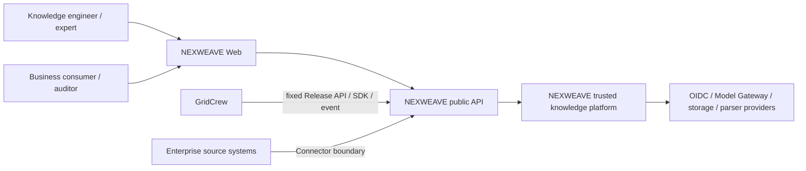
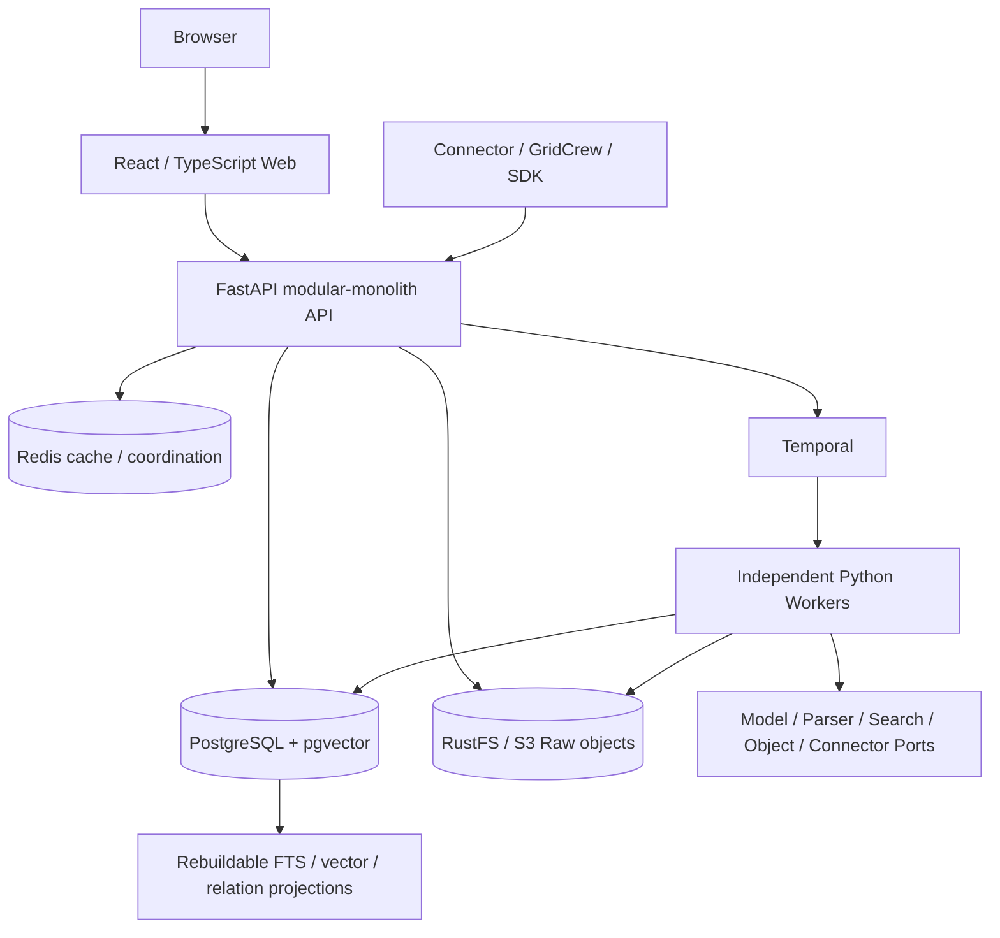
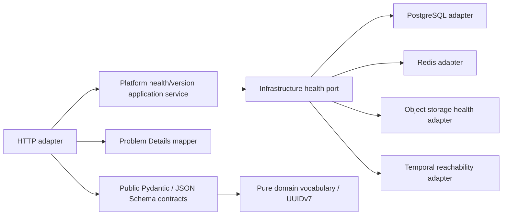
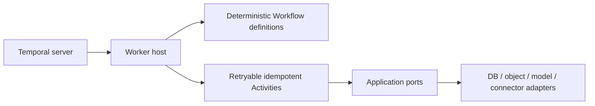

# M0 C4 Architecture Baseline

> Status: Accepted in M0. Context and container views are also summarized in `ARCHITECTURE_BASELINE.md`; this document freezes the component and deployment responsibilities used by the executable skeleton.

## Level 1 — System context

NEXWEAVE owns knowledge ingestion, compilation, evidence, review, evaluation, immutable release and trusted query. It does not own GridCrew task orchestration or directly share GridCrew business state.

## Level 2 — Containers

M0 runs these containers through Compose. The M0 API exposes platform health/version/diagnostics only; the Worker registers one deterministic health workflow. The diagram includes future ports to freeze dependency direction, not to claim those adapters are implemented.

## Level 3 — API components

Future business modules must follow `HTTP/Worker adapter → application → domain`. ORM, FastAPI, Temporal and provider SDKs cannot enter `packages/domain` or `packages/contracts`; an automated architecture test enforces the rule.

## Level 3 — Worker components

M0 implements only `PlatformHealthWorkflow`, which returns a deterministic marker and performs no I/O. Business workflows and Activities begin in their approved Milestones.

## Source tree mapping

| Boundary | Location | M0 content |
|---|---|---|
| Web adapter | `apps/web` | infrastructure readiness shell only |
| API adapter/application | `apps/api` | health, version, sanitized diagnostics |
| Pure domain | `packages/domain` | UUIDv7 and frozen vocabulary |
| Public contracts | `packages/contracts` | Pydantic, JSON Schema and OpenAPI snapshots |
| Workflow host | `workers/health` | deterministic health workflow |
| Persistence evolution | `migrations` | platform foundation migration only |
| Local deployment | `compose.yaml`, Dockerfiles | PostgreSQL/Redis/RustFS/Temporal/API/Worker/Web |

## Evolution constraints

- Split a module into a service only after stable Port/contract evidence exists; database table ownership and outbox behavior must remain explicit.
- Search/vector/graph stores are projections, not business authority.
- Provider reuse with GridCrew never grants shared business database or implicit availability authority.
- Production Kubernetes, HA, DR and domestic-platform certification are later-stage deployment decisions, not M0 claims.
