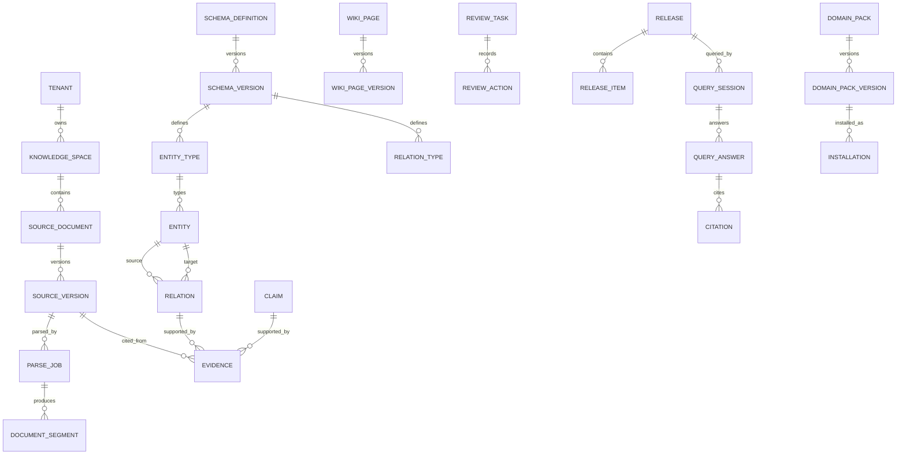

# Data Model Baseline

> M0 冻结逻辑数据边界，M1/M2 已分别由 `0002`/`0003` 实现并验收。M3 Source/Parse 逻辑语义已由 ADR-0021 校准，但 `0004` 和下列 Source 表尚未建立。

## 1. 核心表域

| 域 | 候选表 |
|---|---|
| 身份/空间 | `tenant`, `organization`, `user_identity`, `service_identity`, `knowledge_space`, `space_member`, `permission_policy` |
| 原始资料 | `source_document`, `source_version`, `source_upload_session`, `source_import_batch`, `source_invalidation`, `parse_job`, `parse_failure_unit`, `document_segment`, `source_anchor` |
| Schema | `schema_definition`, `schema_version`, `entity_type`, `relation_type`, `page_template`, `lint_rule` |
| 知识 | `wiki_page`, `wiki_page_version`, `entity`, `entity_alias`, `relation`, `claim`, `evidence`, `conflict` |
| 编译/审核 | `compile_job`, `compile_step`, `review_task`, `review_action`, `approval` |
| 通用工作流投影 | `workflow_task`, `workflow_step`, `workflow_task_event` |
| 质量/发布 | `evaluation_suite`, `evaluation_run`, `release_candidate`, `release`, `release_item`, `release_pointer` |
| 查询 | `query_session`, `query_answer`, `citation` |
| Pack/集成 | `domain_pack`, `domain_pack_version`, `installation`, `connector`, `connector_sync_run`, `model_profile`, `prompt_version` |
| 治理 | `audit_log`, `outbox_event`, `system_configuration` |

## 2. 通用字段策略

业务表原则上包含：

- `id`：UUIDv7，由应用边界生成；数据库不以可猜序列替代；
- `tenant_id`：所有非全局对象必填；
- `space_id`：空间对象必填，全局/租户级对象可空但需显式约束；
- `status`：稳定枚举，不使用展示文本；
- `version` 或 `etag`：乐观锁/业务版本；
- `created_by`, `updated_by`, `created_at`, `updated_at`；
- `archived_at`：需要软归档的稳定身份对象；
- `correlation_id`：关键异步/集成链路；
- `classification`：保存 Raw 或敏感知识的对象。

租户隔离同时存在应用授权、强制查询过滤和数据库复合外键/约束。ADR-0019 决定 M1 不启用 RLS：连接池事务级上下文、后台任务 bypass 和恢复运维证据尚未冻结；RLS 可在后续作为纵深防御，但不得替代当前三层控制或被表述为已实现。

## 3. M1 物理表增量

| 能力 | 表/增量 | M1 语义 |
|---|---|---|
| 服务受众与租户角色 | `service_identity_audiences`, `tenant_role_assignments` | user/service 主体分离，活动角色唯一，服务 audience 显式化 |
| 空间授权 | `space_members`, `space_member_roles` | USER/SERVICE 成员、策略版本、密级、撤销保留 |
| 幂等 | `idempotency_records` | operation + key + request hash；相同请求回放，不同负载冲突 |
| 治理配置 | `model_profiles`, `prompt_versions`, `connector_definitions` | Secret 引用、Prompt 追加版本、Connector 仅定义不执行 |
| 对象基础 | `object_upload_sessions`, `managed_objects` | 会话过期、对象 key/version/checksum/size/type/classification/scan 状态 |
| M0 表扩展 | identity/space/audit/outbox 约束与字段 | clearance、version、audit actor/trace、业务事件 payload |

`PromptVersion`、`AuditLog`、`OutboxEvent` 为追加事实；`KnowledgeSpace` 采用软归档；M1 API 不提供任何物理删除核心业务事实的路径。关联表和幂等基础设施按其结构语义保存范围/时间字段，不冒充独立业务聚合。

## 3.1 M2 物理表增量

| 表 | M2 语义 | 权威/不可变规则 |
|---|---|---|
| `workflow_tasks` | tenant/space 范围的业务任务、稳定 Workflow ID、Run ID、状态/进度、version、projection revision/sync | 查询投影；Temporal 执行事实为权威，不可由 DB 轮询推进 |
| `workflow_steps` | 固定步骤计划、attempt、状态、消息与时间 | 可从 Temporal/Activity 事实修复；不代表 CompileStep 等后续业务结果 |
| `workflow_task_events` | 命令、步骤、补偿、对账的稳定 event key 日志 | append-only trigger 禁止 update/delete；重复 Activity 用 event key 幂等 |

M2 Task/Step/Event 均包含稳定 UUIDv7 与 tenant/space 范围；Task 写入复用 M1 Audit/Outbox/Idempotency。`input_refs` 仅为有界引用 JSON，不承载 Raw、Secret 或业务正文。

## 4. Raw 与对象存储

- `SourceDocument` 是逻辑资料；每次内容变化创建不可变 `SourceVersion`。
- `SourceVersion` 保存 SHA-256、大小、MIME、来源、密级、对象 key、上传者和替代关系。
- Source 上传会话在写入前预分配 SourceDocument/SourceVersion ID；ImportBatch 只汇总逐项结果，部分失败不回滚成功项。
- 对象 key 使用稳定逻辑结构，不暴露本机绝对路径；同 key 不得静默覆盖。
- 原始字节权威在对象存储；数据库保存元数据、checksum 和状态。
- checksum 去重与业务重复提示分离：相同字节可幂等，元数据相似只提示，不自动合并。
- 每次 reparse 新建 ParseJob 并固定 parser/OCR/config/document-model/locator 版本；retry 保持同一输入配置。
- SourceVersion 分开保存 active/latest ParseJob；reparse 失败不破坏既有 active 结果。失效保存 append-only SourceInvalidation，不覆盖解析状态。
- Segment/Anchor 绑定 ParseJob；重定位创建新 Anchor 与 predecessor 关系，不改写历史 locator。

## 5. 版本与不可变约束

- `SchemaVersion`、`WikiPageVersion`、`PromptVersion`、`DomainPackVersion`、`Release` 和 `ReleaseItem` 追加式，不原地覆盖。
- Wiki 稳定 ID 与内容版本分离；人工保护区在重编译中必须保持。
- Release manifest 固定对象版本、Schema、Prompt/Model 和索引配置；发布后不可修改。
- 回滚创建/更新 `ReleasePointer`，不修改历史 Release。
- AI 对象保存 `compile_job_id`、`compile_step_id`、`model_profile_id`、`prompt_version_id` 和输入 SourceVersion 集合。
- 人工修改保存 actor、时间、diff、理由和所基于的旧版本。

## 6. Claim / Evidence / Citation 约束

- 进入正式审核的 Claim 至少一个有效 Evidence；正式因果 Relation 同样要求 Evidence。
- Evidence 必须绑定不可变 SourceVersion 和可验证 SourceAnchor，并声明支持/反对方向。
- Anchor 失效不会删除 Evidence；状态只能变为 `STALE`、`UNRESOLVED` 或 `REVOKED` 并阻断相应发布或引用；不得使用 `INVALID`。
- Citation 必须绑定固定 Release、QueryAnswer、Evidence/ReleaseItem，且返回前校验 Anchor。
- 证据不足、冲突未决或权限不足必须产生明确结果，不生成伪引用。

## 7. Outbox 与事件日志

`outbox_event` 与业务事务同库提交，候选字段：`event_id`, `event_type`, `schema_version`, `aggregate_type`, `aggregate_id`, `tenant_id`, `space_id`, `actor`, `correlation_id`, `causation_id`, `occurred_at`, `payload`, `status`, `attempt_count`, `published_at`。

事件发布者只负责投递和重试，不重新解释业务状态。消费者以 `event_id + consumer` 幂等。长期事件保留、分区、死信和清理策略由 M0/M8 冻结。

## 8. 逻辑 ER 草图

## 9. PostgreSQL、pgvector 与图边界

- PostgreSQL 是 R1 业务事实候选权威数据库。
- pgvector 存储可重建 embedding 投影；向量相似度不是事实可信度。
- Relation 表保存类型化关系业务事实；图遍历服务可基于 Relation 和固定 Release 运行。
- OpenSearch/Milvus/Neo4j/NebulaGraph 均为可替换投影 Provider，不得改变 Release 语义或成为唯一事实源。

## 10. PostgreSQL / 达梦适配风险

- JSON/JSONB、UUID、数组、全文检索、向量、部分索引、RLS、时间类型和 `ON CONFLICT` 语义存在差异；
- Alembic/SQLAlchemy 方言、事务隔离、锁、批量写入和分页需契约测试；
- 不得在 domain/application 中写 PostgreSQL 专用 SQL；
- 达梦/CUD4.0 适配当前建议置于 Provider/交付壳，R2 再做正式认证。

## 11. 后续冻结项

ADR-0021 已冻结 Source/Parse/Anchor 逻辑语义；具体 `0004` 物理列、索引和 parser adapter 仍需在 M3 实现并以真实迁移证据验收。Broker 事件保留、Release manifest 存储、知识投影索引版本、生产 RLS 运维模型及知识大数据迁移/回滚策略仍按对应 Milestone 冻结。M2 通用任务投影由 ADR-0020 与 `0003` 实现；生产 Temporal history retention/升级与大规模投影分区仍需部署证据。
