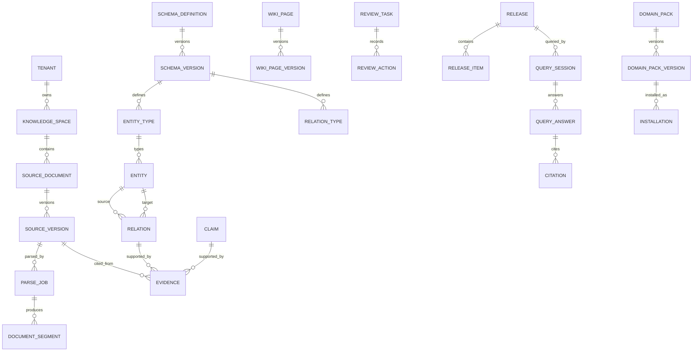

# Data Model Baseline

> M0 冻结逻辑数据边界并建立 `0001_m0_platform_foundation` Alembic 迁移。该迁移只含通用租户/组织/身份/空间/审计/Outbox/配置/平台版本；下列知识业务表均未建立。

## 1. 核心表域

| 域 | 候选表 |
|---|---|
| 身份/空间 | `tenant`, `organization`, `user_identity`, `service_identity`, `knowledge_space`, `space_member`, `permission_policy` |
| 原始资料 | `source_document`, `source_version`, `parse_job`, `document_segment`, `source_anchor` |
| Schema | `schema_definition`, `schema_version`, `entity_type`, `relation_type`, `page_template`, `lint_rule` |
| 知识 | `wiki_page`, `wiki_page_version`, `entity`, `entity_alias`, `relation`, `claim`, `evidence`, `conflict` |
| 编译/审核 | `compile_job`, `compile_step`, `review_task`, `review_action`, `approval` |
| 质量/发布 | `evaluation_suite`, `evaluation_run`, `release_candidate`, `release`, `release_item`, `release_pointer` |
| 查询 | `query_session`, `query_answer`, `citation` |
| Pack/集成 | `domain_pack`, `domain_pack_version`, `installation`, `connector`, `connector_sync_run`, `model_profile`, `prompt_version` |
| 治理 | `audit_log`, `outbox_event`, `system_configuration` |

## 2. 通用字段策略

业务表原则上包含：

- `id`：UUIDv7，由应用边界生成；数据库不以可猜序列替代；
- `tenant_id`：所有非全局对象必填；
- `space_id`：空间对象必填，全局/租户级对象可空但需显式约束；
- `status`：稳定枚举，不使用展示文本；
- `version` 或 `etag`：乐观锁/业务版本；
- `created_by`, `updated_by`, `created_at`, `updated_at`；
- `archived_at`：需要软归档的稳定身份对象；
- `correlation_id`：关键异步/集成链路；
- `classification`：保存 Raw 或敏感知识的对象。

租户隔离必须同时存在应用授权、查询过滤和数据库级验证策略；M0 以复合外键/约束打底，RLS 是否作为纵深防御在 M1 权限实现时以真实查询和运维证据决策。

## 3. Raw 与对象存储

- `SourceDocument` 是逻辑资料；每次内容变化创建不可变 `SourceVersion`。
- `SourceVersion` 保存 SHA-256、大小、MIME、来源、密级、对象 key、上传者和替代关系。
- 对象 key 使用稳定逻辑结构，不暴露本机绝对路径；同 key 不得静默覆盖。
- 原始字节权威在对象存储；数据库保存元数据、checksum 和状态。
- checksum 去重与业务重复提示分离：相同字节可幂等，元数据相似只提示，不自动合并。

## 4. 版本与不可变约束

- `SchemaVersion`、`WikiPageVersion`、`PromptVersion`、`DomainPackVersion`、`Release` 和 `ReleaseItem` 追加式，不原地覆盖。
- Wiki 稳定 ID 与内容版本分离；人工保护区在重编译中必须保持。
- Release manifest 固定对象版本、Schema、Prompt/Model 和索引配置；发布后不可修改。
- 回滚创建/更新 `ReleasePointer`，不修改历史 Release。
- AI 对象保存 `compile_job_id`、`compile_step_id`、`model_profile_id`、`prompt_version_id` 和输入 SourceVersion 集合。
- 人工修改保存 actor、时间、diff、理由和所基于的旧版本。

## 5. Claim / Evidence / Citation 约束

- 进入正式审核的 Claim 至少一个有效 Evidence；正式因果 Relation 同样要求 Evidence。
- Evidence 必须绑定不可变 SourceVersion 和可验证 SourceAnchor，并声明支持/反对方向。
- Anchor 失效不会删除 Evidence；状态变为 STALE/INVALID 并阻断相应发布或引用。
- Citation 必须绑定固定 Release、QueryAnswer、Evidence/ReleaseItem，且返回前校验 Anchor。
- 证据不足、冲突未决或权限不足必须产生明确结果，不生成伪引用。

## 6. Outbox 与事件日志

`outbox_event` 与业务事务同库提交，候选字段：`event_id`, `event_type`, `schema_version`, `aggregate_type`, `aggregate_id`, `tenant_id`, `space_id`, `actor`, `correlation_id`, `causation_id`, `occurred_at`, `payload`, `status`, `attempt_count`, `published_at`。

事件发布者只负责投递和重试，不重新解释业务状态。消费者以 `event_id + consumer` 幂等。长期事件保留、分区、死信和清理策略由 M0/M8 冻结。

## 7. 逻辑 ER 草图

## 8. PostgreSQL、pgvector 与图边界

- PostgreSQL 是 R1 业务事实候选权威数据库。
- pgvector 存储可重建 embedding 投影；向量相似度不是事实可信度。
- Relation 表保存类型化关系业务事实；图遍历服务可基于 Relation 和固定 Release 运行。
- OpenSearch/Milvus/Neo4j/NebulaGraph 均为可替换投影 Provider，不得改变 Release 语义或成为唯一事实源。

## 9. PostgreSQL / 达梦适配风险

- JSON/JSONB、UUID、数组、全文检索、向量、部分索引、RLS、时间类型和 `ON CONFLICT` 语义存在差异；
- Alembic/SQLAlchemy 方言、事务隔离、锁、批量写入和分页需契约测试；
- 不得在 domain/application 中写 PostgreSQL 专用 SQL；
- 达梦/CUD4.0 适配当前建议置于 Provider/交付壳，R2 再做正式认证。

## 10. 待 M0 冻结

主 ID、表名单复数策略、RLS、删除/归档、版本表结构、事件保留、Anchor 表示、Release manifest 存储、密钥引用、索引版本和数据迁移回滚策略。
