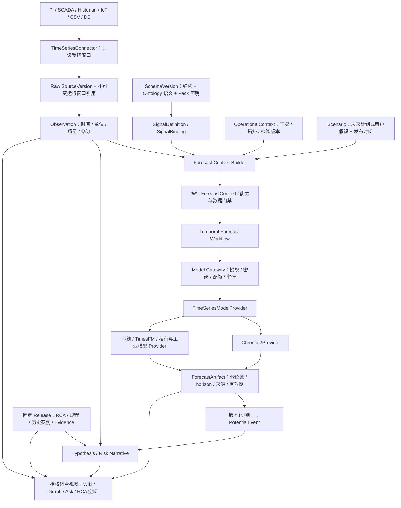

# NEXWEAVE R1 Architecture Consolidation Review 与 R2 Living Knowledge 路线图

> 日期：2026-09-07｜状态：**评审交付 / R2 提案，未批准实施**  
> 基线：当前真实工作区，HEAD `51fa9fd9d4e3327dfe3db4125fcecb1d8660808c`；大量既有未提交文件属于评审输入，不能用 HEAD 代表全部实现。  
> 授权：本轮只做 Repository / 数据库核查、架构收口和路线重规划。未下发 M9.5、M10 或任何新业务实现。  
> 相关：[核查证据](R1_CONSOLIDATION_EVIDENCE_2026-09-07.md)、[ADR-0031 提案](adr/ADR-0031-living-knowledge-extension-proposal.md)、[待决项](../../OPEN_QUESTIONS.md)。

**结论：此次升级属于中等架构调整，应以独立领域边界内的增量扩展落地，不需要重做 R1。** 保留模块化单体、PostgreSQL、S3/ObjectStorage、Temporal、SchemaVersion 单一语义权威、Claim/Evidence/Review/Release 和现有 React 工作台。新增受治理的运行观测、预测与假设能力，并为它们建立独立生命周期与查询契约。不要把时序数值包装成 LLM 文本，也不要把模型输出装入正式 Claim 以求快速复用。

建议把 M9.5 定位为 **R1 冻结之后、R2 全面实施之前的验证桥梁**。R1 仍为 M0—M9；原 R2 M10—M12 的企业治理、检索评测、生产部署目标继续保留，重新分配增量。M9.5 的归属与正式任务书需明确批准；它不回填 R1，不豁免 M9 的专家与真实发布门禁。

## ① R1 架构收口评估

### 1.1 已有主干、实际限度与处置

| 能力 | 当前实现证据与限度 | 收口判断 / R2 处理 |
|---|---|---|
| 平台组织方式 | FastAPI 模块化单体、独立 Worker、React/TS；domain/application/contracts 有依赖边界测试 | 保留；本轮相关 88 项 Python 测试通过。无需微服务化或更换语言 |
| Raw / Source | 受控上传、扫描、SourceVersion、ParseJob、SourceAnchor、追加版本；已有 CSV/XLSX 表格解析定位 | 复用不可变原始窗口制品；不能把逐点连续数据直接送入逐文档 Compile |
| Schema / Ontology | `SemanticDeclarations`、确定性 Pack 组合、`SchemaVersion` 快照与 checksum；Ontology 是逻辑语义视图 | 保留 ADR-0022；新增时序声明，不另建 OntologyVersion / 本体发布中心 |
| Domain Pack | 已签名 `equipment-rca-pack@1.0.0`；领域类型、因果关系、模板、Lint 和评测声明 | 保留旧签名与旧字节；时序内容发布新 Pack 版本。P-101 实例和现场 tag 属空间配置 |
| Compile / 模型 | `ModelGatewayPort` 存在；实际默认注入 `LocalModelGateway`，结构化编译为本地确定性实现，embedding 为 16 维哈希值 | 是本地可回放验收能力，不能当作真实 LLM/语义 embedding 或工业模型集成已完成 |
| Claim / Evidence / Review | 候选与正式对象分离；Evidence 绑定 SourceAnchor；独立审核、支持/反向证据与冲突 | 强复用边界；Forecast / Hypothesis 不得自动晋升正式事实 |
| Release / Query | 不可变 Release/Item、指针历史、质量门禁、固定 Release 抽取式问答、引用与拒答 | 保留旧 API 默认行为；动态问答另建显式组合契约，不放宽 `query_release` |
| Graph | M7 固定 Release Relation Graph；M8 Wiki 链接图为另一种导航投影 | 在同一 Explorer 中保留两种来源，再加独立动态覆盖层；Wiki link ≠ 证据关系 ≠ 预测关联 |
| 集成 | `ReadOnlyConnectorProvider` 有 FILESYSTEM/S3/WEB_REST/GIT；返回文件字节，受 allowlist 控制 | 有可复用治理，但尚无工业时序范围读取、质量码、修订和计划快照契约 |
| Workflow | 已有业务 v2 Workflow 与历史 v1 定义，I/O 位于 Activity | 新增独立 Forecast Workflow 与推理队列；不改写历史类型，不让 GPU 阻塞编译/审核 |
| 前端 | 17 个真实受保护入口、Shell、token、Wiki/Schema/Graph/Ask/集成页面 | 延续信息架构；没有独立 P-101/设备运行页面。RCA 是 Pack/空间语境，不应声称已存在完整设备台账 |

### 1.2 本轮实查与冻结资格

本地数据库实际迁移头为 `0009_m8`；查到 SourceVersion 90、SchemaVersion 56、Claim 4、Release 0、QueryAnswer 0；22 个 ModelProfile 均标记 `nexweave.local`。这些是本次连接的本地库聚合快照，包含技术测试用途，**不是生产数据规模、领域有效知识数量或历史所有环境统计**。

数据库存在 Source/Schema/Claim/Evidence/Release/审计不可变保护；公共表启用 RLS 数量为 0，与 ADR-0019 的应用授权、范围查询和复合外键策略一致。不能宣称已具备数据库行级隔离防线。

本次运行容器列表中 API、Web、PostgreSQL、Redis、RustFS、Temporal、ClamAV healthy，未见业务 Worker/Parser sandbox 运行。未启动服务或执行写入式 E2E。历史 M7 隔离闭环与当前环境可演示性是不同证据。

M9 报告明确：9 份/610 页公开调查资料准入、4 份 Source→Compile 技术试点完成；真实专家、批准阈值、正式 RCA Review→Evaluate→Release→Query 仍缺。现有公开跨行业事故报告不是 P-101 给水泵的运行数据、设备手册或现场故障真值。**R1 架构可以收口，R1 业务冻结验收目前仍有阻塞。** 本报告不替用户宣布 M9 验收。

冻结前的最小行动集：

1. 明确可复现的工作区交付基线、构建摘要与运行版本，保留用户未提交修改；由既有发布流程决定提交，不自动提交或 push。
2. 恢复指定验收环境的完整 Worker 拓扑，执行现有 R1 真实闭环和必要故障验证，补上 M9 的真实评审与批准证据。
3. 对下述具体疑点做有针对性的 R1 修复评审；不以 Living Knowledge 为由重做已验收业务。
4. 分别登记代码测试通过、环境可运行、模型有效性、专家接受度和正式验收状态。

### 1.3 需要优先验证的具体架构债务

| 编号 | 代码证据 | 影响与处理建议 |
|---|---|---|
| AC-01 | `PlatformRepository → WorkflowRepository → SourceRepository → SemanticRepository → KnowledgeRepository → ReviewRepository → ReleaseRepository → IntegrationRepository`，`app.py` 实例化最后一层 | 仓储继承链承载跨域服务与 SQL；不要再加 `ForecastRepository(IntegrationRepository)`。新增模块采用应用服务 + 组合端口；旧模块只在触及处逐步抽离 |
| AC-02 | `KnowledgeRepository.__init__` 参数绑定具体 `LocalModelGateway`；Query SQL 直接在 ReleaseRepository | Port 声明与运行时替换能力不完全等价。新预测从第一天依赖中立端口，并在组装入口注入；R1 编译与问答改造单列迁移 |
| AC-03 | `traverse_graph` 的关系查询按 Release/tenant/space 过滤，但节点从 `knowledge_entities` 当前行按 ID 读取，且把请求的起点直接加入节点集合 | 需验证任意起点的成员资格/密级/跨空间拒绝，以及历史节点属性是否漂移。列为冻结前安全与版本完整性核查，不因边过滤就推定节点安全；本轮未做越权利用或宣称漏洞已复现 |
| AC-04 | Graph SQL 先 `LIMIT 2000`，应用再遍历，最终 `truncated` 主要检查 500 边输出 | 有限候选图不等于全图最短路径；可能未完整披露数据库预截断。先完善边界说明/截断契约，规模需求再决定索引与图引擎 |
| AC-05 | Query 使用本地哈希 embedding；`filters` 写入 retrieval_config，但所读检索路径未见任意业务过滤的完整执行 | 不应宣称成熟语义检索或全量过滤器。M9.5 RCA 关联优先稳定 key/已发布关系和人工核准案例，M11 再完善真实召回/排序与评测 |
| AC-06 | 当前 UI 报告仍有 Schema 图形编辑、Graph Fit/Layout、集成连接测试等 PARTIAL；设计系统文档与最新视觉决策有漂移 | 活化交互要建立在可用的工作台与明确状态上。按最新 OQ-FE-VISUAL-002 和当前 token 保留深墨/紫/青方向；先校准文档，不重新换主题 |

AC-03/04/05 是静态审阅结论和待验证风险，不等于已完成安全审计。相关实现在查清与修复验收前不扩展到跨空间动态图/Ask。

### 1.4 为什么是中等调整

纯“小增量”不足：需要新的时间语义、质量与修订机制、数值模型能力、动态引用和组合查询边界；仅加几张表或一个模型页面会污染 Evidence/Release。核心重构也无必要：身份、空间、稳定实体、单一 Schema、Raw、可靠工作流和治理主干都可保留。受影响最大的区域是模型/Connector 适配、应用服务组装、Schema 契约和 Graph/Ask 组合读取；历史事实与发布权威保持不动。

## ② Dynamic / Living Knowledge 目标架构



Schema 与 Ontology 是**同一 SchemaVersion 的结构视图与语义视图**；图上不设置两个权威库。Context Builder 从冻结声明和明确 Binding 中自动解析输入，自动化是确定性的契约解析，不是让 LLM 从任意关联节点猜测模型特征。

建议新增三个模块边界，仍部署在现有单体与独立 Worker 体系：

| 模块 | 责任 | 不承担 |
|---|---|---|
| Operational Knowledge | Signal 定义/绑定、受控观察窗口、运行上下文、质量与新鲜度 | 长期工业采集总线、所有 tag 的全量 Historian、控制回路 |
| Forecasting | Context 冻结、Provider 能力匹配、运行、输出归一化、预测评估 | 正式知识发布、RCA 根因裁决、数学优化 |
| Dynamic Interpretation | PotentialEvent 规则、Hypothesis、带分层引用的风险叙述与动态查询 | 将相关性写成因果、自动处置或绕过审核 |

外部系统继续持有高频历史数据；NEXWEAVE 只保留授权窗口、原始回执、可重放输入和派生制品。PostgreSQL 保存元数据、版本、关系与审计，S3 保存窗口与预测数组，动态索引是可重建投影，Redis 只作缓存。首期不引入 TSDB、Kafka、Neo4j、在线 Feature Store 或新控制平台；未来只有容量/延迟证据支持时另立 ADR。

复杂约束与多目标决策归 OptiForge；动作执行归 GridCrew。R2 只预留独立、受授权的派生分析交换契约。既有 GridCrew 固定 Release API 不突然收到实时预测；OptiForge/GridCrew 集成未在本轮实现或重新下发。

## ③ 新增领域对象及与现有对象关系

所有新对象继承 tenant/space/分类/创建者/审计要求。稳定 ID、不可变版本 ID、ETag 修订号分别表达身份、输入快照和并发控制，不能混用。表名与 API 名称以下均为提案。

| 对象 / 所属边界 | 最小内容 | 与现有对象的关系 / 生命周期 |
|---|---|---|
| **SignalDefinition** / Operational | stable key、被测 quantity、所属 type/property、单位与量纲、值类型、采样/聚合允许策略、缺测/新鲜度策略、允许角色 | 作为 SchemaVersion 中的声明子对象，不建立第二套 Schema 发布生命周期；不含现场 tag 或凭据 |
| **SignalBinding** / Operational | entity_id + entity_version_id、SignalDefinition key + schema_version_id、ConnectorInstance、受控 external series key、单位转换、有效时间、mapping checksum | 一对象可有多测点；重复/冲突绑定阻断。`DRAFT→VALIDATED→ACTIVE→SUSPENDED/RETIRED`，修改创建新版本；历史绑定不随设备改名改变 |
| **Observation** / Operational | binding_version_id、event_time、recorded_at、available_at、value/unit、原始 quality code、规范化质量、revision、source window/locator、provenance | 表示“某来源在该时间记录了什么”，不是经审核的真理。批量值可存数组制品，领域上仍可定位单点/窗口；纠正追加新 revision |
| **OperationalContext** / Operational | entity/topology snapshot refs、有效时间窗、运行模式、检修状态、环境/控制计划引用、构建规则、各字段来源和 epistemic kind | 基于明确 EntityVersion/Relation/Release 与观察构建不可变快照；插值或模型推断的模式仍标 Inferred |
| **ForecastContext** / Forecasting | 固定历史窗口、Target/Past/Future 绑定、cutoff、data_as_of、频率、horizon、quantiles、Schema/Pack/Release、OperationalContext、Scenario、预处理与解析说明 checksum | 运行前冻结；每个已选/被排除输入有理由。`PREPARED/INVALID/FROZEN` 概念状态，冻结后改动另建 Context |
| **ForecastRun** / Forecasting | context_id/hash、model profile/provider revision、Workflow/attempt、请求键、预算、状态、耗时、错误、artifact refs | `QUEUED→VALIDATING→RUNNING→SUCCEEDED/FAILED/CANCELLED`；数据/能力门禁失败可 `BLOCKED`；重试不修改已成功输出 |
| **ForecastArtifact** / Forecasting | target/time/quantile 数组、origin、horizon、units、input/output hashes、model/library/container revision、推理设置、校准引用、warnings、valid_until | 不可变模型派生制品；`artifact_id` 与储存引用分离。过期/撤销是追加资格事件或查询状态，不改历史数组 |
| **PotentialEvent** / Interpretation | entity、event type key、event window、rule/version、threshold + units + authority ref、ForecastArtifact/Observation refs、触发条件、适用性与资格 | 候选未来事件；severity 来自批准领域规则，不是概率。`OPEN→ACKNOWLEDGED/DISMISSED/SUPERSEDED/EXPIRED`，结果对照另写 assessment |
| **Hypothesis** / Interpretation | proposition、scope、正反 typed refs、假设/缺失输入、验证计划、提出者/规则/模型版本、review/outcome | `PROPOSED→UNDER_REVIEW→SUPPORTED/REFUTED/INCONCLUSIVE`；SUPPORTED 仍不自动成为 Claim，需独立进入现有审核发布链 |

为使上述核心对象可复现，首期还需少量支撑值对象/记录，而非新增一批“中心”：

- `RawTimeSeriesWindowRef`：SourceVersion/ManagedObject、ConnectorSyncRun、原始返回字节 hash、source revision、tag 集合、时间范围、查询定义 checksum、获取时间和保留策略。外部可变 URL + 时间范围不足以重放，必须有稳定版本或授权快照。
- `ObservationLocator`：window/version、series key、时间范围、行/列或块位置、quality mask/hash；首期是新引用类型，不冒充既有 SourceAnchor。
- `ScenarioDefinition`：版本化未来路径、单位、起止、来源 `ISSUED_PLAN / USER_ASSUMPTION / EXTERNAL_FORECAST`、issued_at、审批/假设状态；名称“基线”不代表已知未来。
- `DynamicAssessment` / Risk Narrative：不可变组合读取结果，固定静态 Release、Observation 修订、ForecastArtifact、Event、Hypothesis、policy/模板/模型版本。是回答/分析快照，不是新的 Knowledge Release。
- `ForecastEvaluation`：冻结 benchmark 数据切分、模型/预处理版本、指标、置信区间和决策；现有 EvaluationSuite 的类型限定为知识问答，不能塞入它的 metadata 就声称时序评测已实现。

两条独立维度必须贯穿契约与 UI：

| 维度 | 值与含义 |
|---|---|
| 认识来源 `epistemic_kind` | Observed（来源记录）、Inferred（规则/模型推导）、Forecast（未来条件分布）、Hypothesis（待验证解释） |
| 治理资格 | 未审核 / 审核中 / 已审核；Released 是正式知识的发布资格，不是第五种认识来源 |

Observed 不自动是 accepted Evidence，Inferred 不等于低质量，Forecast 永远不因人工点击批准变成“已发生”。一项已发布知识可以是有证据约束的推论；关键在于保留推论身份与依据，不把发布标签解释成观测真值。

## ④ TimeSeriesModelProvider 与 Chronos2Provider

### 4.1 端口与网关分工

`TimeSeriesModelProvider` 是 application 的通用数值预测端口，厂商 SDK 仅位于 adapter/专用推理 Worker。调用它必须经过 Model Gateway 的统一授权、密级、预算、审计与超时策略；它不是绕开 Model Gateway 的另一条模型通道。不要让它继承以 Prompt/segments 为中心的 `ModelGatewayRequest`。

```text
TimeSeriesModelProvider
  capabilities(model_revision) -> TimeSeriesCapabilities
  validate(ForecastRequest) -> ValidationReport
  forecast(ForecastRequest, execution_context) -> ForecastResult

TimeSeriesCapabilities
  contract_version; provider_id; model_revision; deployment_mode
  target_count_limit; past_covariates; known_future_covariates
  categorical_covariates; static_context_encoding
  regular_grid_required; missing_value_policy
  context_limit; horizon_limit; supported_quantiles
  output_kind: POINT | MARGINAL_QUANTILES | JOINT_SAMPLES
  cross_learning_policy; input/resource_limits

ForecastRequest
  context_id/hash; scoped immutable input refs
  target/past/future channel schema; grid; horizon; quantiles
  preprocessing_version; model_profile_revision; idempotency_key

ForecastResult
  provider_request_id; model_revision; input/output hashes
  target/timestamp/unit/quantile values OR declared samples
  diagnostics; warnings; runtime; usage/cost basis
```

这是契约草案，不是已创建的 Python 接口。公共 domain/contracts 不包含 torch、pandas、numpy tensor、HTTP vendor payload 或任意 Python 代码。Remote Provider 的 submit/status/cancel 由内部适配器封装；平台执行状态仍由 ForecastRun/Temporal 管理。资源使用采用点数、channel、CPU/GPU 时间/内存与成本，不把数值预测预算硬换算成 LLM token。

能力匹配必须 fail closed：场景要求 Future Covariates 而 Provider 不支持时，返回 `PROVIDER_CAPABILITY_MISMATCH`。不得静默丢弃未来负荷、改用单变量或换模型后保留原运行标签。若策略允许后备 Provider，必须创建可追溯的新 attempt/Run，披露模型变化与重新评估资格。

### 4.2 Chronos-2 的已确认事实与适配策略

官方模型卡说明：Chronos-2 是 120M encoder-only 模型，支持单变量、多变量、历史及已知未来数值/类别协变量，输出多步分位数；卡片列出 8192 context 与 1024 prediction steps，CPU/GPU 可运行。它不是 Chronos-Bolt 的 205M 版本，公开通用 benchmark 也不证明 P-101 适用。模型卡标注 Apache-2.0。[官方模型卡](https://huggingface.co/amazon/chronos-2)

官方示例提供 `Chronos2Pipeline.predict_df(context_df, future_df=..., prediction_length=..., quantile_levels=[0.1,0.5,0.9])`。适配器可把冻结通道映射到长表，并显式取得分位数列；不要把通用 `predictions` 列当作 P50。[官方代码库](https://github.com/amazon-science/chronos-forecasting)

官方当前代码允许长 horizon 启发式延展；cross-learning 会共同处理输入任务，准确性不保证提升且受 batch 影响。**平台自行执行已 benchmark 的上下文/horizon 上限**，不依赖库默认警告；M9.5 默认关闭跨任务 cross-learning，同一实体内批准的多变量输入仍可使用。记录 batch/group、设备、精度与全部推理设置，禁止跨租户拼 batch 共享信息。[官方 pipeline](https://github.com/amazon-science/chronos-forecasting/blob/main/src/chronos/chronos2/pipeline.py)

`future_df` 的时刻必须匹配预期预测网格，且其列被转换为未来协变量。适配器保持输入校验开启，独立验证 role、单位、完整 horizon 和历史可用性，不自动补齐缺失未来计划。[官方数据转换实现](https://github.com/amazon-science/chronos-forecasting/blob/main/src/chronos/df_utils.py)

领域文本不是 Chronos-2 的通用文字 Prompt。Ontology Context 的作用是选择测点、约束单位与时间、筛选工况、绑定规则和解释结果。说明书/RCA 正文只进入已发布知识检索与叙述；只有经批准编码的类别/数值特征才进入数值模型。禁止把任意 Context 字符串交给 Provider 并声称它理解设备机理。

首发部署建议为内网独立推理 Worker/服务，固定 wheel、checkpoint revision/hash、镜像 digest、依赖与权重许可。实现前做供应链登记、资源测试和网络禁出验证；本轮未安装库、下载权重或启动推理。

### 4.3 保留真正的替换空间

| 候选 | 进入比较的用途 | 替换限制 |
|---|---|---|
| Persistence / Seasonal Naive / 简单回归 | 必选质量与成本基线；明确哪些可使用未来负荷 | 无区间的模型只输出点预测，不伪造 P10/P90；区间要独立方法与校准 |
| Chronos-2 | 首个真实适配与零样本、多变量/协变量 benchmark | 按测点、工况、horizon 决定适用范围，无默认中标权 |
| TimesFM | 备选适配与同输入对照 | 逐版本检查原生协变量或外部回归路线、分位数和许可，不能把品牌能力作统一承诺 |
| 客户私有模型 | 客户授权、内网部署、可能拥有更相关训练数据 | 需能力声明、revision、可审计输入输出、泄漏与校准测试 |
| 专业工业时序模型 | 强周期、设备机理特征、高频信号等专项对照 | 领域特征处理在批准的 adapter/Pack 声明中，不向内核写入设备分支 |

检索时 Google 官方仓库已区分 TimesFM 2.5 的 XReg 协变量方案与 3.0 的原生多变量/协变量；同时明确 3.0 预训练权重使用单独的非商业、非生产许可，2.5 及以前权重仍为 Apache-2.0。因此商业候选应按确切版本和可用授权准入，不能自动选“最新”。这只是本次来源核查，采用前仍须按锁定制品复核。[TimesFM 官方能力与许可说明](https://github.com/google-research/timesfm)

## ⑤ Ontology / Domain Pack 时序语义扩展

### 5.1 在现有 SchemaVersion 上扩展

现有 `PropertyDeclaration` 有数据类型/基数/引用，`RelationTypeDeclaration` 有 `temporal` 和 `causal` 布尔值；尚无测量单位、采样、时序角色、延迟和未来计划语义。`temporal=true` 仅说明关系具有时间性，不等于它可以成为协变量。

建议版本化增加 `signalDefinitions`、`forecastProfiles`、`contextRules`、`potentialEventRules` 声明块。需要同步 contracts、规范化/签名规则、组合与兼容分析、存储投影、OpenAPI/SDK、Schema Studio；不能只把任意 JSON 塞进现有 `ui` 或 `definition` 来跳过检查。

旧 `ContractModel` 为 `extra=forbid`，不能声称新字段对旧客户端天然兼容。新语义契约通过明确版本协商/新资源表示启用；旧 v1alpha1 Pack 原字节、checksum、composition 和 API 表示继续可读取。旧快照不能因自动补空声明而改变 checksum。旧 schema 未声明时序能力时展示“不支持运行绑定”，不自动迁移。

Target/Past/Future/Context 角色由 **ForecastProfile 中的输入使用方式**决定，不永久绑死测点：负荷在某模型是 Target，在温度预测中是 Past 或 Future Covariate。SignalDefinition 只声明可接受角色与语义约束。

| 角色 | 解析规则 | 禁止行为 |
|---|---|---|
| Target | 明确 entity、quantity、binding、单位与质量；预测 cut-off 之后的值 | 把未来已观测标签作为模型输入 |
| Past Covariate | 值的 event_time 不晚于 cutoff，且 available_at 不晚于 data_as_of | 回测使用后来补到的传感器值而不披露修订 |
| Known Future Covariate | 未来 horizon 覆盖完整；issued_at ≤ data_as_of；固定计划/假设版本与来源 | 把未来实际负荷伪装成当时已知的计划 |
| Context | 运行模式、拓扑、维修、环境等带来源与生效窗的条件；由 profile 指定筛选/编码/解释用途 | 从语义邻居任意抓信号，或把 Context 文本当成因果证明 |

### 5.2 Equipment RCA Pack 的责任

在现有 `nexweave.io/equipment` 共用类型与 `equipment.rca/component` 等稳定 key 上增量声明泵/轴承等必要子类型或测量定义，避免另造 Equipment 双身份。Pack 定义温度、振动指标、润滑、负荷、故障模式、适用工况、专家解释模板与评测语义；核心只理解 quantity/unit/role/有效时间/质量/关系等通用契约。

P-101 是空间内实体别名，唯一性由 tenant/space + 设备登记身份保障。具体 tag、安装位置、传感器校准、阈值、额定值与负荷计划必须来自该试点经过授权的映射和手册，不能写进全球通用 Pack。相同温度单位也不代表测量位置可互换。

Pack 规则仅调用平台内建、限资源的声明式操作，如比较、持续窗口、质量筛选、单位转换与引用选择。禁止 Python/SQL/任意表达式执行。现有文本 `expert-rule` 不自动成为可执行 Event 规则。

### 5.3 Context Builder 的确定性步骤

1. 授权并固定 subject EntityVersion、一个静态 Release 与 PUBLISHED SchemaVersion；首片优先使用与 Release 一致的 Schema。跨 Schema 只允许显式兼容映射，未证明兼容就阻断。
2. 依 ForecastProfile 解析显式/有界关系路径、SignalBinding 有效区间；零个、多个歧义匹配或单位/设备身份不符时返回诊断，不猜测。
3. 冻结 cutoff/data_as_of、网格、时间区、DST 处理、窗口长度、延迟水位及 source revision。
4. 校验数据重复/乱序/缺测/质量码/传感器更换/停机与检修模式；只执行 profile 批准的重采样、聚合和缺测处理，保留原始 mask 与转换 lineage。
5. 解析未来计划或用户 Scenario 路径；标明哪些是确定日历/已发计划、哪些是假设、哪些是另一模型预测。后者的不确定性不因作为协变量输入而自动传播。
6. 执行 Provider 能力、资源、数据密级与适用域检查；输出完整输入 manifest、排除说明和 checksum，冻结 ForecastContext 后才排队。

## ⑥ ForecastArtifact 与 Evidence / Release 的边界

### 6.1 两条生命周期与一次明确关联

```text
观测路径：原始运行窗口 → Observation → 可定位观察资料
          → ClaimCandidate + EvidenceCandidate → 既有 Review/Evaluate → 新 Release

预测路径：冻结 ForecastContext → ForecastRun → ForecastArtifact
          → PotentialEvent / Hypothesis / Risk Narrative → 动态视图

后验验证：未来到来后的新 Observation → ForecastEvaluation / HypothesisAssessment
          （不修改原预测，也不自动发布事实）
```

ForecastArtifact 的 provenance 证明“模型在这些输入与条件下产生了这个结果”，不证明未来事件会发生。即使预测被专家看过，仍保持 Forecast 身份。Risk Narrative 的文本也不能经文档上传“洗成”Observed Evidence：派生资料必须保留 `origin_kind=MODEL_DERIVED`、原制品引用与用途限制，并在审核门禁中禁止充当预测事件发生的唯一实证。

首片不扩展既有 `evidence_records.source_anchor_id` 约束，不把 ObservationLocator/ForecastArtifact ID 填进去。若要把已发生的观察转为正式知识，可生成带 Raw 引用与计算谱系的观察资料，经现有 Source/Parse/Anchor 流程及人工审核；该转换必须标明原始实测、聚合或插值。以后若直接支持时间区间 Evidence，另立 ADR、locator 版本和迁移/SDK/Citation 兼容测试。

### 6.2 概率与 Potential Event

- P10/P50/P90 是给定输入与场景下、每个预测时刻的边际分位数。P10–P90 是名义 80% 区间，实际覆盖要在工业数据上校准，不是“80% 可信知识”。
- P90 越过阈值，只能按批准规则显示“上分位进入关注区间”。不能直接说“90% 故障概率”。若阈值高于某分位数，只能在分布与校准假设成立时讨论有限尾部界限，首片不做未经验证的概率插值。
- 从三个分位数无法可靠计算“未来两小时至少一次越限”“连续十分钟越限”或多信号联合故障概率。首片可报告某条分位数曲线连续越阈的**规则条件**，不得称其为事件概率。
- 只有 Provider 提供经验证的联合路径分布/抽样，并有事件级校准时，才可另启 `event_probability`。否则该字段为 null，附明确原因；不能默认 0。
- 没有批准阈值、适用工况或足够质量时，返回 `NOT_EVALUATED`，不能用零事件表达“无风险”。
- 新预测取代视图中的旧预测时，旧 Artifact/Event 保留；数据迟到、绑定错误、模型撤销等生成 invalidation/supersession，历史回答复现时同时显示原内容与当前资格说明。

### 6.3 Query / Graph / 发布隔离

保留现有 `query_release` 和 Citation：一个空间内的单一固定 Release，未显式请求动态能力时行为不变。增加 `DynamicAssessment` 查询路径，输入固定 `release_id + entity_id + data_as_of + observation refs + forecast/scenario refs`，响应按段给出类型化引用：

| 引用类型 | 点击后到达 | 可支持的陈述 |
|---|---|---|
| ReleaseCitation | 现有 Evidence / SourceAnchor / 固定 Claim | 已发布机理、规程与历史案例 |
| ObservationReference | 原始窗口、测点、时刻、质量码、修订 | “该测点当时记录为……” |
| ForecastReference | 预测曲线、输入、条件、模型版本、有效期 | “在所列条件下，模型预测……” |
| HypothesisReference | 支持/反向引用、假设、验证要求 | “尚待验证的一种解释是……” |

组合视图不是把动态对象合并进 Release Graph，更不修改 Release manifest。知识正文与动态覆盖层可一起看，但导出/分享须固定所有引用和生成时间；旧 Markdown/Obsidian/Release 导出默认保留静态语义。

所有来源在模型调用、组合读取和结果回读时重新授权。派生结果不能低于输入密级/策略的联合约束；不能先对不可见测点预测，再仅隐藏输入来源把结果给低权限用户。缓存至少按 tenant/space、策略版本、权限作用域、Release、context/artifact/scenario hash 分区。权限变化允许拒绝历史内容访问，不承诺历史授权永久有效。

### 6.4 Scenario Forecast 不是因果推断

“未来两小时负荷从 70% 升到 95%”还缺路径定义：瞬时阶跃、线性爬坡或分段计划是不同输入。界面应先确认路径和时间区，显示每个未来时间格的值及其 `USER_ASSUMPTION` 身份，再运行。

基线与场景使用相同历史 cutoff、输入修订、模型、预处理、horizon 和其余假设，仅按显式场景改变批准的 Future Covariate。对比呈现两组条件预测及差值摘要，不能声称差值就是负荷的因果效应；两个场景的边际分位数之差也不是差值分布的分位数。超出历史负荷/爬坡范围时显示适用性不足或阻断，不能用语义合理性替代模型外推证据。

## ⑦ 新 R2 M9.5～M12 Roadmap

以下顺序与工作量是规划，不是下发或承诺工期。每个阶段以可审查制品和真实验收证据结束；未正式批准前不编码。M9.5 退出后允许缩减/更换 Provider/延后预测，不把已经投入的适配工作当作继续投入的理由。

| 阶段 | 产品/技术交付 | 真实验收与停止条件 |
|---|---|---|
| **R1 收口前置** | 关闭 M9 专家/阈值/实际 Release 证据；可复现环境；验证 AC-03 等现存边界 | 用户验收 R1；不可变知识、隔离和固定版本问答不退化。未通过不能用 M9.5 替代 |
| **M9.5：P-101 可行性与纵向验证** | M9.5-0 冻结最小契约/数据；M9.5-1 真实窗口回放+Binding+Context；M9.5-2 真实 Chronos 与基线/Scenario；M9.5-3 Artifact→Event→RCA/规程/案例→Narrative→Wiki/Graph/Ask | 一台实体、受限测点、一个 horizon 主场景、有批准规则的条件风险；真实 DB/S3/Temporal/模型与 UI。逐样本追溯、拒绝路径、恢复、旧 R1 回归；由 benchmark 决定 Go/限定 Go/换模型/No-Go |
| **M10：可治理的运行知识与有限生产试用** | 正式 Signal/Binding/Observation/OperationalContext；时序 Connector 产品化；稳定动态读取契约；小范围预测服务与企业权限/组织/空间/服务身份/配额/保留策略 | 至少两个授权实体或工况验证无 P-101 专用分支；新权限/密级/修订隔离、幂等、删除/保留与引用可追溯；批准范围内 shadow pilot。不得推迟基础安全到 M12 |
| **M11：持续知识与条件预测解释** | 多 horizon/Scenario 管理；第二个真实合格 Provider；预测评测/漂移、反馈；真实检索与排序；静态/运行/未来图层；持续编译→重新审核→补丁 Release | Provider 替换无需改领域契约；同冻结输入对照；回测不泄漏；分位覆盖/误报/拒答评测；旧 Release 可复现；Forecast/Hypothesis 不自动发布 |
| **M12：企业生产交付与规模验证** | HA/DR、离线与国产适配、供应链、GPU/CPU 隔离与容量、历史制品/审计恢复、规模 UI/查询、批准 SLO | 真实备份恢复重放 Raw/Binding/Context/Artifact/Release；受控停机与积压/过期演练；按批准目标验收时延、吞吐、可用性与容量；形成支持矩阵 |

### 7.1 原 M10～M12 的责任不丢失

| 原任务 | 新分配 | 不应发生的缩减 |
|---|---|---|
| M10 组织、委托管理、对象/字段/密级、导出、预算与运营 | 继续 M10；测点、派生制品、计划与模型执行纳入；首片所需最小护栏提前到 M9.5 | 不以模型接入代替企业治理，不把前端过滤当权限 |
| M11 高级检索、图、持续编译、评测 | M11 保留并加入动态时间/预测/场景评测；M9.5 仅实现纵向所需最小读取 | 不预设必须上专用图数据库，也不把哈希 embedding 称为工业语义检索 |
| M12 HA、灾备、百万实体/数百万关系、国产化、离线供应链 | M12 保留，容量模型增加时序窗口/数组/模型 Worker | 不能把 P-101 单实体成功外推生产规模；不复制第二领域内核 |

### 7.2 M9.5 之后的决策分支

- **Go**：数据、模型、区间、解释、权限和可重复性均达到预先批准门槛；进入 M10 的限定设备/工况。
- **限定 Go**：单变量预测有效、未来协变量无增益或场景覆盖不足；仅上线已验证部分，Scenario 标记研究/不可用，不能保留假可用按钮。
- **换模型**：Chronos-2 不及合格基线/客户模型；保留 Context/Artifact/治理接口，换 Provider 后重跑相同 benchmark。
- **No-Go / Data First**：质量/样本/标签/校准无法支持预测；R2 仍可做 Observation、运行状态、案例关联与企业治理，暂停 Forecast 产品化。不能用合成数据把此关口改为通过。

## ⑧ 首个 P-101 给水泵 Vertical Slice

### 8.1 范围与准入

首片对象为**用户指定试点的真实 P-101**，尚未证实数据已具备；不是把任意公开泵数据改名为 P-101。第一数据源优先选择 PI/Historian 的授权历史导出 CSV，走真实 TimeSeriesConnector；直连 PI/SCADA 是后续 adapter，不是证明端到端必须先建采集平台。

准入清单由数据/设备/安全负责人确认：设备身份与拓扑；tag 字典、位置、单位、频率、质量码；传感器更换与校准；时钟/时区；运行/停机/检修时间；真实负荷变化记录；当时发布的未来计划版本；文档来源与授权；阈值批准人和适用工况；故障/事件标签与盲审标准。无数据持有者授权时不导入。

首片建议配置（**候选实验参数，不是实际设备事实或安全限值**）：

| 项目 | 建议 | 原因 / 改变条件 |
|---|---|---|
| Target | 优先一个轴承温度测点；可增加一个来源清楚的振动统计量作第二 Target | 先证明一个可追溯数值链，避免一次绑定几十测点 |
| Past Covariates | 历史负荷、振动统计量、可用的润滑相关测点/环境测点 | 仅有真实测点和明确测量语义才纳入；每个输入做增益对照 |
| Future Covariate | 已发布负荷计划；用户 70%→95% 路径作为独立假设场景 | 不能把实际未来负荷作为计划；负荷本身有不确定性时披露 |
| Context | 启停/稳态/检修、设备与部件版本、批准规程和历史案例 Release | 没有 Context 的工况区间要明确未知 |
| 网格与 horizon | 暂以 1 分钟网格、未来 120 步、24–72 小时历史作为起点 | 依传感器/物理响应和 benchmark 冻结；不强制把秒级高频波形平均为分钟温度式信号 |
| 历史覆盖 | 优先数周至数月、覆盖多次负荷变化与不同工况 | 几小时数据可验链路，不能验工业效果；事件稀少时不能估计故障概率 |
| 触发 | 手动或低频受控历史回放；未来可周期更新 | 首期不做毫秒监视、控制报警或告警确认替代 |

振动必须指明 RMS/峰值/频段/速度或加速度等语义；专业谱特征可由受治理上游/适配器产生并固定版本。高频原始波形仍留在专业系统。不得从名称“振动”推定单位与特征含义。

### 8.2 从输入到现有产品的真实 E2E

1. **静态底座**：P-101 手册、适用规程和历史案例经已有 Source→Schema→Compile/人工整理→Review→Evaluate→Release，形成一个真实批准 Release；与设备无关的 NTSB 资料不能冒充它。当前本地无 Release，首片不能跳过此输入。
2. **原始运行资料**：只读 Connector 得到原始 CSV/回执，执行受控存储、hash、准入和 SourceVersion；保存 extractor/query/config 版本及读取窗口。原始值不被补值或模型结果覆盖。
3. **Binding**：专家将真实 tag 绑定 P-101 实体/部件/SignalDefinition，验证单位、位置、有效期；模拟同名 tag、错误单位、跨空间绑定必须被拒绝。
4. **Context**：按指定历史预测原点 t0 构建冻结 Context；展示数据截止、可获得时间、缺测、运行模式、历史/未来输入、排除理由及固定知识版本。
5. **真实推理**：通过 Gateway/Temporal/Chronos2Provider 调用真实权重；基线模型用同输入窗口对照；保存完整 Artifact。没有模型、数据不足或能力不匹配时返回真实错误，不展示演示曲线。
6. **潜在事件**：批准规则计算分位曲线是否进入关注区域，保留规则/阈值/文档引用；未触发也要返回 `EVALUATED_NO_MATCH` 及质量状态，区分未评估。
7. **知识解释**：稳定实体与 Pack 关系检索同 Release 的 RCA 候选机理、适用规程和历史案例，包含反证与适用性。首片允许确定性模板生成 Risk Narrative；若使用 LLM，需另接真实、已治理的 Provider，不能称本地字符串拼接为 LLM 推理。
8. **三个现有入口**：Wiki 中看 P-101 正文+运行/预测侧页；Graph 查看静态已发布关系与动态虚线事件；Ask 请求该实体的动态分析，展示 Observed/Forecast/Hypothesis/Released 引用。刷新、深链接与跨页跳转固定同一 assessment，而非各自抓“最新”。
9. **场景对比**：确认未来两小时负荷路径，分别运行基线/假设场景；关联两个 Artifact，比较中位趋势、区间、适用性及 PotentialEvent 变化；不输出控制建议、最优负荷或因果结论。
10. **后验与恢复**：拿到 t0 后真实观察后追加评估，不改预测；验证重复提交、Worker 中断、模型超时、对象写成功/数据库失败、权限撤销、计划修订和数据迟到。恢复后至多一个正式完成 Artifact 绑定同一业务幂等结果，无幽灵成功与半写入事件。

每条正向链至少交付：SourceVersion/输入 hash、Binding/Schema/Pack/Release refs、Context、Run/Workflow/attempt、真实模型版本、Artifact、Event/无匹配记录、Narrative/引用、三个 UI 的同源截图及后验评估；敏感 Raw 和日志不进 Git。

### 8.3 Benchmark 与验收设计

先冻结 Evaluation Protocol，再运行候选模型；门槛由产品/设备专家/数据负责人批准，不能看结果后选择有利指标。

| 方面 | 方法 | 不能宣称的结果 |
|---|---|---|
| 数据切分 | 按时间滚动预测原点，按工况/负荷段/检修前后分层；训练/校准/选择窗口与最终盲测隔离；重叠窗口用 block 层次报告不确定性 | 随机拆行导致邻近未来泄漏；同一事件多个窗口当独立故障样本 |
| 可获得性 | 每原点锁 `available_at / plan issued_at / source revision`；历史未来实测仅作标签 | 无计划历史时可做 oracle 上界实验，但不能计入可部署 Scenario 成绩 |
| 数值精度 | 每 Target/工况/horizon 报 MAE、适用时 MASE、分位 pinball loss；零尺度/常量序列显式处理 | 用平均跨设备分数隐藏最差工况；近零值盲用百分比误差 |
| 区间 | P10–P90 经验覆盖率、宽度与 interval score；P50 偏差；校准集独立 | 名义 80% 当作实测覆盖；只扩大区间就宣布模型优良 |
| 协变量与场景 | 无协变量、Past-only、真实当时已知 Future 输入消融；历史类似负荷变化分层；检查超出训练/历史支持域 | 场景变化的真值不存在时，不能声称验证了反事实或因果正确性 |
| Event / 假设 | 有真实标签时评估事件级 precision/recall、提前量、每设备日误报与专家接受率；缺标签单独报告 | 没有故障样本时把阈值越限检测当故障诊断准确率 |
| 工程与治理 | CPU/GPU 时间、内存、P95 执行时间、单位成本；授权/审计/血缘完整率、重复提交与失败恢复、陈旧拒绝 | 用公开 GPU 吞吐当部署承诺，或用演示帧率代替 E2E 延迟 |

模型去留要同时考虑效果、校准、场景适用性、运行成本和解释质量。最低工程门禁可硬性要求：成功结果引用齐全、错误身份/单位/未来泄漏拒绝、旧 R1 不退化；业务准确率、误报、可接受迟延与阈值均列为待批准值。若 Chronos 不能稳定优于或满足预定非劣效要求于合格简单基线，则不扩展预测产品化。

真实历史回放可以验证 Real E2E，但报告必须写“真实历史回放”；只有接入连续授权数据并持续验证新鲜度后才能称“在线 shadow pilot”，不能把 historical replay 的最后一刻叫“当前”。

## ⑨ 高保真原型与现有前端的信息架构升级

保留 Shell、业务分组、深色知识工作台和现有真实路由，不新增“Chronos 中心”。当前 token 与 OQ-FE-VISUAL-002 已恢复深墨、紫色主操作、青色证据/导航；较早 `FRONTEND_DESIGN_SYSTEM.md` 中弱化赛博视觉的段落不应作为再次改色依据。本轮不修改原型或前端，不声称新的像素/交互验收已完成。

| 入口 | 增量信息架构与交互 | 必须显式的边界 |
|---|---|---|
| Schema Studio | 类型/属性检查器增加“测量语义”“预测输入配置”；编辑单位、允许角色、采样、质量、Context 路径；预览解析结果与兼容差异 | 不能只留 JSON 编辑。角色是 profile 的使用方式；显示有效 Schema/Pack 版本与冲突 |
| Wiki | 保留目录/正文/来源三栏；设备页增加“知识 / 运行状态 / 预测与场景”局部页签，右栏可切 Evidence/Observation/Forecast 输入 | 静态正文仍固定版本；不因动态刷新写新 WikiPageVersion。无设备实例或 Binding 则提供真实引导 |
| 关系图谱 | 保留 Wiki 链接图与 Release 关系图区分；Release Explorer 增加 Observed/Inferred/Forecast/Hypothesis 覆盖开关、as-of 与 forecast horizon | 图例同时用文字/线型；预测边虚线、待验证边点线。未来态≠时间切片历史事实，分图来源不可混淆 |
| Ask NEXWEAVE | 默认“已发布知识”；显式切“运行与预测”，先解析对象、时间、计划路径并展示 Context 摘要，再运行 | 生成新预测是有成本/权限的动作，与查询已有 Artifact 分开。回答分块展示已观察、模型预测、候选解释、依据/缺失证据 |
| 集成中心 | Connector 卡片增加运行数据能力、窗口/水位、tag 映射、质量、新鲜度与只读状态；模型 Profile 管理列能力/版本/验证范围 | 不把配置保存当连接成功；缺工业 adapter 就标不可用，不能用 Mock REST 冒充 PI |
| Equipment RCA 空间/设备页 | 在现有 Wiki/Graph/Ask 内形成 Pack 驱动的 P-101 对象视图：运行→潜在事件→候选机理→验证方法→规程/案例 | 平台无设备特判；Pack 提供声明式布局元数据，平台提供受控通用组件；尚无独立 Equipment 页面，不假定已经实现 |
| 质量 / 任务 / 发布 | 任务中心显示 ForecastRun；质量区分知识质量与预测效果；发布中心继续固定知识审批 | 预测“完成”不同于质量“合格”，更不同于知识“发布”；不新增一个可把 Forecast 发布成事实的按钮 |

建议复用/新增通用组件：`TemporalContextBar`、`KnowledgeLayerBadge`、`ForecastBandChart`、`ScenarioPathEditor`、`ProvenanceInspector`、`DataFreshnessState`。首片只完成必要交互，不批量重写 17 页。

曲线横轴同时标历史 cutoff、未来区间和时区；实测实线、预测中位虚线、P10–P90 半透明区间，图旁保留数值表/键盘阅读。加载、局部缺测、质量不合格、过期、未计算、模型失败、无权限、没有批准阈值、场景超域必须不同状态。旧结果可看但带“截至……”与失效原因，不用绿色状态掩盖数据中断。

可恢复上下文建议包含 `entity / release / asOf / assessment / scenario / run` 等稳定引用，使用现有 URL/History 机制；鉴权由服务端执行。大数组由受控窗口 API 分页/降采样，前端裁剪仅用于展示且不影响规则计算。条件提示放在场景输入与结果旁，不能仅藏在全局免责声明。

## ⑩ 风险、技术债、冻结能力与实施契约清单

### 10.1 风险优先级

| 优先级 / 风险 | 关口与处理 |
|---|---|
| P0：M9 真实专家/阈值/Release 链未闭合 | R1 冻结前；M9.5 不代替旧验收 |
| P0（首片准入）：真实 P-101 数据/身份/文档/授权缺失 | 数据负责人确认后才可 Real E2E；无数据则只保留方案，不伪造曲线 |
| P0（启用动态前）：预测、观测、证据与发布混淆 | 契约 typed refs、独立资格/生命周期、派生来源审核、禁止自动晋升 |
| 高优先核查：现有 Graph 起点/节点权限与历史版本 | AC-03；独立负向测试验证，修复范围保持在 R1；未证实前不扩展跨空间动态合成 |
| P1：数据迟到、修订、缺测、时区、单位、传感器更换 | bitemporal 可获得性与原始快照、Binding 版本、质量门禁；不静默改历史 |
| P1：未来数据泄漏、负荷路径失真、工况外推 | issued_at 回测、Scenario path 冻结、OOD/工况覆盖、协变量消融 |
| P1：分位误用、罕见故障样本少 | 首期无事件概率承诺，按事件标签和窗口相关性评测，专家确认解释 |
| P1：模型资源/供应链与替换成本 | 独立 Worker、能力矩阵、精确版本/权重许可、SBOM；Chronos 失败有基线或无预测模式 |
| P1：单体仓储继承与散落策略 | 新模块组合端口；逐触点提取授权/审计/事务能力，避免全库抽象重写 |
| P1：真实 LLM/embedding、Secret Provider、生产身份联调不足 | 显式限定本地技术能力；M10/M11 补真实 adapter 与质量/安全验证 |
| P1：静态规则/拓扑过期或修订影响预测解释 | Context 固定版本；生效窗和 supersession 事件使新解释重新计算，不改历史 |
| P2：RustFS SPK-004、HA/DR/国产化与规模性能遗留 | 沿用已披露门禁，M12 用真实环境证据关闭，不因选了 S3 接口就声明供应链风险消失 |

### 10.2 R1 必须冻结不动的能力

Raw 原字节与 checksum；既有 SourceVersion/SourceAnchor 定位与失效语义；SchemaVersion 唯一有效语义权威和旧 canonicalization；已签名 Pack 原内容；Claim/Evidence 支持与反证；Review 职责分离；Conflict 显式处理；Release/ReleaseItem 不可变与 pointer-only rollback；Query 默认单一固定 Release；既有 Citation；Wiki 人工保护区/追加版本；Obsidian 仅草稿回流；tenant/space/密级/审计；历史 Temporal 类型与 replay；现有真实前端路由/状态；GridCrew 独立且延期边界。

冻结的是语义与历史证据，不是禁止修正已证实缺陷。R1 bug 修复仍必须有对应测试与兼容性证明；新语义在新契约中明确表达。

### 10.3 建议 API / 事件 / Workflow 与落点

| 提案资源 | 行为 / 契约要求 |
|---|---|
| `GET /spaces/{id}/signal-definitions?schema_version_id=…` | 读取 Schema 内声明，不另建定义发布权威 |
| `POST /spaces/{id}/signal-bindings`；版本验证/激活命令 | 幂等、强 ETag、作用域复合 FK、审计与受控 mapping；不能跨权限试探 tag |
| `POST /spaces/{id}/observation-imports`；`GET …/observations` | 异步窗口读取返回业务 ID/Workflow ID；读取显式范围、as-of、质量与分页上限 |
| `POST /spaces/{id}/forecast-contexts` / `…/scenarios` | 解析预览与冻结；保存全部假设，不自动发起费用型推理 |
| `POST /spaces/{id}/forecast-runs`；`GET /forecast-runs/{id}` | 返回 202 + run/workflow；请求键相同内容不同返回冲突；取消/重试遵循显式状态机 |
| `GET /forecast-artifacts/{id}`；`GET …/potential-events` | 固定制品与资格、范围限制、重新授权；下载只经 ObjectStorage 受控引用 |
| `POST /spaces/{id}/dynamic-assessments`；`GET /dynamic-assessments/{id}` | 同固定 Release + 显式动态 refs；分层陈述和类型化引用；R1 QueryAnswer 契约保持原样 |

通用错误包括 `BINDING_AMBIGUOUS`、`UNIT_MISMATCH`、`INPUT_NOT_AVAILABLE_AS_OF`、`DATA_QUALITY_INSUFFICIENT`、`FUTURE_COVARIATE_INCOMPLETE`、`SCENARIO_OUT_OF_SUPPORT`、`PROVIDER_CAPABILITY_MISMATCH`、`MODEL_RESOURCE_EXCEEDED`、`FORECAST_STALE`；错误格式复用现有 Problem/trace 规范。

事件提案：`signal-binding.activated.v1`、`observation-window.materialized.v1`、`forecast.completed.v1`、`forecast.failed.v1`、`potential-event.created.v1`、`dynamic-assessment.created.v1`、`artifact.invalidated.v1`。事件只含 scoped IDs/checksums/版本，不含数组、凭据或敏感叙述；持久化与 Outbox 同事务。动态事件不得复用 `release.published`。

新增 `nexweave.observation-ingestion.v1`、`nexweave.forecast.v1` 业务 Workflow。步骤为授权上下文装载、窗口物化、质量/能力校验、推理、结果验证、制品提交、规则/解释和投影。Workflow 只编排；活动使用稳定业务键、内容寻址对象、幂等提交与孤儿制品对账，先物化后原子可见。GPU 重试可能产生不完全相同的数值，需保留 attempt 与首次被接受的完成制品，不承诺跨硬件 bitwise 相同；可复现是输入/制品可还原，重算容差另定义。

代码落点建议：`packages/domain/.../operational.py`、`forecasting.py`、`dynamic_interpretation.py`；contracts 对应 typed resources；application 端口和用例；API 中独立 route/repository adapters；专用 forecast Worker；前端现有页面组件增量。这些均未创建实现文件。

数据库采用 additive migrations，在执行时选用当时空闲 revision；不预先占用现有迁移编号或修改 0001–0009。新增对象表、scope FK、唯一版本、input fingerprint/幂等键、不可变触发器和授权索引；数组不逐点膨胀业务 Relation。升级在生产副本验证；旧应用只读旧表继续可用。回退先关闭动态能力/停止新入队并保留新制品，验证 R1 sentinel；删除已产生审计引用的数据不作为生产回滚手段，完整降级仅在隔离迁移测试库验证。

### 10.4 规划需求追踪与本轮回报

下列 ID 是本提案的追踪标签，**状态均为 PROPOSED，未写成已验收实现**；正式立项时纳入主 RTM，与现有 NXW-SCHEMA、PACK、QUERY、GRAPH、INTEGRATION、KQ 和 NFR 对齐。

| 提案 ID | 用户要求 / 对应章节 | 验收载体 / 阶段 |
|---|---|---|
| NXW-LK-001 | R1 收口与调整等级 / ① | 核查证据、AC 风险复核；R1 收口 |
| NXW-LK-002 | 通用运行数据与动态对象 / ②③ | 领域/契约/版本/隔离；M9.5→M10 |
| NXW-LK-003 | Provider 可替换、Chronos 首发 / ④ | 真实 Provider conformance/benchmark；M9.5→M11 |
| NXW-LK-004 | Schema/Ontology/Pack 时序语义 / ⑤ | 旧签名兼容、确定性组合、Binding 解析；M9.5→M10 |
| NXW-LK-005 | Forecast/Evidence/Release 隔离 / ⑥ | 拒绝晋升、typed citation、权限/不可变回归；M9.5 起每阶段 |
| NXW-LK-006 | R2 重规划 / ⑦ | 阶段准入、原责任映射、Go/No-Go；立项时 |
| NXW-LK-007 | P-101 Real E2E 与条件预测 / ⑧ | 实际数据/模型/知识/界面/后验与失败证据；M9.5 |
| NXW-LK-008 | Wiki/Schema/Graph/Ask/集成活化 / ⑨ | 可恢复路由、状态、分层、来源与真实 API；M9.5→M11 |
| NXW-LK-009 | 风险/技术债/生产与不动范围 / ⑩ | 风险/OQ、兼容/迁移/恢复报告；R1→M12 |

本轮实际完成：真实代码/迁移/契约/领域包/前端/原型/治理资料审查、本地数据库只读核查、官方模型能力核对、针对性既有测试、完整十项方案与待决记录。新增设计提案、证据记录、Proposed ADR；仅向 OPEN_QUESTIONS 追加待决项。未修改业务代码、API schema、Domain Pack、旧任务书、历史迁移或已接受 ADR；未导入运行数据、未执行推理、未重新发布知识。

验证：Python 指定架构/领域/契约/安全/Workflow 子集 **88 passed**；Web **23 passed**；TypeScript typecheck 通过。未重跑全量后端/远程 CI、真实写入 E2E、迁移升降级、工业 benchmark、生产性能或新 UI 渲染。当前数据库结构与数量核查是只读，不是业务验收测试。

安全与证据：只读取结构与聚合计数，不提取业务正文/凭据；无新依赖/权重/外部数据上传，无数据库修改。未伪造专家批准、阈值、模型成绩或现场测点。R1 既有风险与 M9 P0 保留；未知项见 OPEN_QUESTIONS。

**停止声明：本轮止于 R1 Architecture Consolidation Review 与 R2 规划提案；未进入 M9.5/M10 实施，也未改变 R1 = M0—M9、R2 = M10—M12 的已批准版本归属。**
